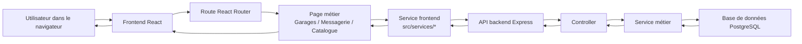
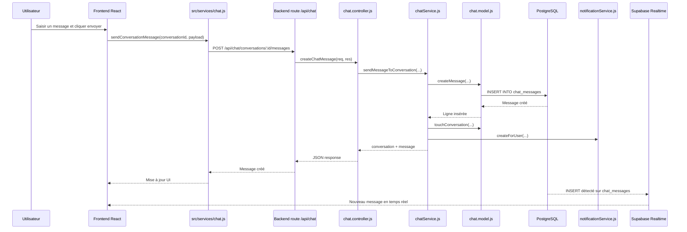

# Documentation des interfaces — Projet PFE

Ce document répertorie toutes les interfaces (pages) du projet, les fichiers frontend et backend associés, les tables/collections probables et les APIs utilisées. Il est généré automatiquement à partir des fichiers sources présents dans le dépôt.

## Tableau des besoins fonctionnels corrigé

| L’acteur | Rôle |
|---|---|
| Automobiliste | L’automobiliste a la possibilité de :<br>• S’authentifier<br>• Gérer son profil<br>• Ajouter / modifier / supprimer un véhicule<br>• Enregistrer les interventions et réparations<br>• Consulter l’historique d’entretien<br>• Rechercher des pièces<br>• Comparer les prix entre vendeurs<br>• Contacter un vendeur via chat<br>• Rechercher des garages proches via géolocalisation<br>• Consulter les services et avis des garages<br>• Réserver un rendez-vous<br>• Consulter et gérer ses rendez-vous<br>• Recevoir des notifications (messages, alertes entretien, confirmation RDV) |
| Agent Garage | Le garage a la possibilité de :<br>• S’authentifier<br>• Gérer son profil<br>• Gérer ses services<br>• Recevoir des demandes de rendez-vous<br>• Valider ou refuser un rendez-vous<br>• Répondre aux messages des automobilistes<br>• Consulter les avis reçus<br>• Consulter son tableau de bord |
| Vendeur de pièces | Le vendeur a la possibilité de :<br>• S’authentifier<br>• Gérer son mot de passe depuis le profil<br>• Gérer son profil<br>• Ajouter / modifier / supprimer des pièces<br>• Gérer le stock<br>• Répondre via chat<br>• Consulter son tableau de bord |
| Administrateur | L’administrateur a la possibilité de :<br>• S’authentifier<br>• Consulter son tableau de bord<br>• Supprimer des comptes<br>• Gérer les signalements<br>• Consulter les statistiques de la plateforme<br>• Consulter les logs d’activité<br>• Superviser les réservations |

---

# Interface Home

## Frontend
* src/pages/Home.jsx
* Utilise : src/components/ChatModal.jsx, src/components/NotificationBell.jsx
* Services : src/services/publicStats.js

## Backend
* routes: /api/public (backend/routes/public.js)
* controllers: backend/controllers/publicController.js

## Base de données
* users
* garages
* pieces
* interventions

## APIs
* GET /api/public/stats (via `getPublicStats`)

## Description
Page d'accueil publique / landing page. Affiche statistiques publiques et liens vers inscription/connexion ou dashboard utilisateur.

---

# Interface Détail Rendez-vous

## Frontend
* src/pages/AppointmentDetail.jsx
* Uses: src/components/PlatformLayout.jsx, src/components/TopBar.jsx
* Services: src/services/appointments.js
* Utils: src/utils/appointmentConstants.js

## Backend
* routes: backend/routes/appointments.js (mounted under `/api/appointments`)
* controllers: backend/controllers/appointment.controller.js
* services/middlewares: backend/services/ (appointment-related services), auth middleware (backend/middlewares)

## Base de données
* appointments
* users
* garages

## APIs
* GET /api/appointments/:id  (via `getAppointment`)
* GET /api/appointments (list) (via `listAppointments`)
* PUT /api/appointments/:id (update via `updateAppointment`)

## Description
Affiche et gère le détail d'un rendez-vous (lecture, messages, accept/reject, proposition de date). Actions appelant l'API rendez-vous.

---

# Interface Home / Unauthorized

## Frontend
* src/pages/Unauthorized.jsx

## Backend
* Pas d'appel API spécifique détecté (page statique)

## Base de données
* aucune

## APIs
* aucune

## Description
Page affichée lorsqu'un utilisateur tente d'accéder à une ressource non autorisée.

---

# Interface Profil utilisateur

## Frontend
* src/pages/profil/profil.jsx
* Uses: src/components/PlatformLayout.jsx
* Services: src/services/user.js

## Backend
* routes: backend/routes/auth.js (ou user/profile endpoints), backend/routes/index.js mount `/api/auth` et routes utilisateurs
* controllers: backend/controllers/profileController.js, backend/controllers/authController.js

## Base de données
* users

## APIs
* PUT /api/auth/profile (updateProfile)
* POST /api/auth/change-password (changePassword)
* DELETE /api/auth (deleteAccount) — ou endpoint user-delete

## Description
Gestion du profil utilisateur : modification des informations, changement de mot de passe et suppression de compte.

---

# Interface Connexion (Login)

## Frontend
* src/pages/auth/login.jsx
* Utilise: `AuthContext` pour `login` / `loginAdmin`

## Backend
* routes: backend/routes/auth.js (mounted `/api/auth`)
* controllers: backend/controllers/authController.js

## Base de données
* users

## APIs
* POST /api/auth/login
* POST /api/auth/login-admin (ou login with role detection)

## Description
Formulaire de connexion pour utilisateurs et logique de redirection selon rôle (admin vers /admin).

---

# Interface Inscription (Register)

## Frontend
* src/pages/auth/Register.jsx
* Services: uses `AuthContext.register` (frontend `src/services/api.js` + `src/services/user.js`)

## Backend
* routes: backend/routes/auth.js
* controllers: backend/controllers/authController.js

## Base de données
* users

## APIs
* POST /api/auth/register

## Description
Formulaire d'inscription avec validation locale (rôle, téléphone, mot de passe), enregistre l'utilisateur via l'API.

---

# Interface Admin Login

## Frontend
* src/pages/auth/AdminLogin.jsx
* Uses: `AuthContext.loginAdmin`

## Backend
* routes: backend/routes/admin.js (admin authentication may be handled in auth.js)
* controllers: backend/controllers/adminController.js, authController.js

## Base de données
* admin users (users)

## APIs
* POST /api/auth/login (admin)

## Description
Authentification dédiée aux administrateurs.

---

# Interface Messagerie (ChatCenter)

## Frontend
* src/pages/chat/ChatCenter.jsx
* Uses: src/components/PlatformLayout.jsx
* Services: src/services/chat.js
* Hooks: realtime subscribe logic (frontend -> supabase client)

## Backend
* routes: backend/routes/chat.routes.js (mounted `/api/chat`)
* controllers: backend/controllers/chat.controller.js, chatContacts.controller.js
* services: backend/services (chat-related)

## Base de données
* messages / conversations / chat_contacts

## APIs
* GET /api/chat/contacts
* GET /api/chat/conversations
* GET /api/chat/conversations/:id/messages
* POST /api/chat/conversations/:id/message
* Realtime subscription via Supabase (supabase client)

## Description
Interface de messagerie temps réel : conversations, envoi et réception de messages, abonnement realtime.

---

# Interface Garage Dashboard

## Frontend
* src/pages/garage/Dashboard.jsx
* Uses: src/components/dashboard/GarageDashboardAppointments.jsx, PlatformLayout
* Services: src/services/garage.js, src/services/user.js

## Backend
* routes: backend/routes/garage.routes.js, backend/routes/appointments.js
* controllers: backend/controllers/garage.controller.js, garageService.controller.js, garageReview.controller.js, appointment.controller.js

## Base de données
* garages
* garage_services
* reviews
* appointments

## APIs
* GET /api/garages/my (getMyGarage)
* GET /api/garages/:id/reviews
* GET/POST /api/garage/services
* POST /api/garages/photos

## Description
Espace métier garage : gestion profil garage, services, photos, planning et consultations de rendez-vous.

---

# Interface Garage Appointments

## Frontend
* src/pages/garage/Appointments.jsx
* Components: shared appointment components under src/components/appointments/
* Services: src/services/appointments.js

## Backend
* routes: backend/routes/appointments.js
* controllers: backend/controllers/appointment.controller.js

## Base de données
* appointments
* users

## APIs
* GET /api/appointments (list with filters)
* PUT /api/appointments/:id

## Description
Affiche la liste des rendez-vous pour le garage et permet d'agir (confirmer, annuler, proposer date).

---

# Interface Automobiliste Dashboard

## Frontend
* src/pages/automobiliste/Dashboard.jsx
* Uses: PlatformLayout, components for appointments, garages
* Services: src/services/appointments.js, src/services/garage.js

## Backend
* routes: backend/routes/appointments.js, backend/routes/garages.js
* controllers: appointment.controller.js, garage.controller.js

## Base de données
* users
* appointments

## APIs
* GET /api/appointments
* GET /api/garages

## Description
Tableau de bord pour l'automobiliste : accès rapide aux garages, rendez-vous et messages.

---

# Interface Automobiliste Appointments

## Frontend
* src/pages/automobiliste/Appointments.jsx
* Components: src/components/appointments/*
* Services: src/services/appointments.js

## Backend
* routes: backend/routes/appointments.js
* controllers: backend/controllers/appointment.controller.js

## Base de données
* appointments
* users

## APIs
* GET /api/appointments?userId=...
* POST /api/appointments

## Description
Gestion et consultation des rendez-vous côté automobiliste, prise de rendez-vous et suivi.

---

# Interface Automobiliste Garages

## Frontend
* src/pages/automobiliste/Garages.jsx
* Components: src/components/GoogleMapGarages.jsx, Garage list components
* Services: src/services/garage.js

## Backend
* routes: backend/routes/garages.js, backend/routes/garage.routes.js
* controllers: backend/controllers/garage.controller.js, garageMatchingController.js

## Base de données
* garages
* garage_locations

## APIs
* GET /api/garages (liste + filtres)
* GET /api/garages/:id

## Description
Rechercher et afficher garages, carte et détails, filtres de proximité et services.

---

# Interface Automobiliste Alerts (Maintenance)

## Frontend
* src/pages/automobiliste/AlertsPage.jsx
* src/pages/automobiliste/maintenance/MaintenancePage.jsx
* Components: AlertCard, MaintenanceCalendar
* Services: src/services/maintenance.js, src/services/maintenanceAlerts.js

## Backend
* routes: backend/routes/maintenance.routes.js, backend/routes/maintenanceAlerts.js
* controllers: backend/controllers/maintenance.controller.js, maintenanceAlert.controller.js

## Base de données
* maintenance_alerts
* maintenance
* vehicles

## APIs
* GET /api/maintenance-alerts
* GET /api/maintenance

## Description
Affiche alertes de maintenance, calendrier et suggestions d'interventions et garages recommandés.

---

# Interface Intervention Detail

## Frontend
* src/pages/automobiliste/InterventionDetail.jsx
* Services: src/services/interventions.js

## Backend
* routes: backend/routes/interventions.js
* controllers: backend/controllers/interventionController.js (ou intervention.controller.js)

## Base de données
* interventions
* vehicles

## APIs
* GET /api/vehicules/:vehicleId/interventions/:id
* PUT /api/vehicules/:vehicleId/interventions/:id

## Description
Détail d'une intervention (historique d'entretien), pièces associées et états.

---

# Interface Vehicle History

## Frontend
* src/pages/automobiliste/VehicleHistory.jsx
* Services: src/services/vehicule.js, src/services/interventions.js

## Backend
* routes: backend/routes/vehicules.js
* controllers: backend/controllers/vehiculeController.js
* controllers: interventionController.js

## Base de données
* vehicules
* interventions

## APIs
* GET /api/vehicules/:vehicleId/interventions

## Description
Historique des interventions et réparations pour un véhicule donné.

---


# Interface Vendeur Catalogue Pieces

## Frontend
* src/pages/vendeur/CataloguePieces.jsx
* Services: src/services/pieces.js, src/services/chat.js, src/services/user.js
* Components: PlatformLayout, map and piece card components

## Backend
* routes: backend/routes/piece.routes.js, backend/routes/pieces.js
* controllers: backend/controllers/piece.controller.js
* services: backend/services/pieceService.js

## Base de données
* pieces
* vendors / vendeurs

## APIs
* GET /api/pieces
* GET /api/pieces/:id
* POST /api/pieces
* PUT /api/pieces/:id

## Description
Catalogue marchand de pièces, gestion CRUD pour vendeurs, comparaison et contact vendeur via chat.

---

# Interface Vendeur Comparaison Prix

## Frontend
* src/pages/vendeur/ComparaisonPrix.jsx
* Services: src/services/pieces.js, src/services/chat.js

## Backend
* routes: backend/routes/pieces.js or piece.routes.js
* controllers: backend/controllers/piece.controller.js

## Base de données
* pieces
* offers / vendor_offers

## APIs
* POST /api/pieces/compare (ou GET /api/pieces?name=...)

## Description
Comparaison multi-vendeurs pour une référence/nom de pièce ; redirection vers chat pour contacter vendeur.

---

# Capture du menu latéral: Garages, Messagerie, Catalogue pièces

Cette capture correspond au menu latéral de l’espace automobiliste. Les trois entrées visibles ne sont pas trois fichiers uniques, mais trois écrans pilotés par un layout commun et un routeur central.

## Emplacement des fichiers principaux

| Élément | Fichier | Rôle |
|---|---|---|
| Menu latéral | frontend/src/components/PlatformLayout.jsx | Construit la sidebar, affiche les liens selon le rôle et gère la navigation active |
| Routage protégé | frontend/src/routes/AppRouter.jsx | Déclare les URLs, protège les pages et associe chaque URL à son écran |
| Garages | frontend/src/pages/automobiliste/Garages.jsx | Affiche la liste des garages, la carte, les filtres et les actions de réservation |
| Messagerie | frontend/src/pages/chat/ChatCenter.jsx | Gère les conversations, les contacts et l’envoi/réception des messages |
| Catalogue pièces | frontend/src/pages/vendeur/CataloguePieces.jsx | Affiche le catalogue, la recherche, la comparaison et le contact vendeur |

## Comment ça fonctionne

1. Le composant [PlatformLayout.jsx](frontend/src/components/PlatformLayout.jsx#L1) affiche le menu latéral.
2. Pour un automobiliste, il ajoute les liens vers `Garages`, `Messagerie` et `Catalogue pièces`.
3. Quand l’utilisateur clique sur un lien, React Router charge la route correspondante dans [AppRouter.jsx](frontend/src/routes/AppRouter.jsx#L1).
4. La route est protégée par `ProtectedRoute`, donc l’écran ne s’ouvre que si le rôle est autorisé.
5. La page chargée appelle ensuite ses services frontend, qui parlent à l’API backend.

### Détail par écran

- [Garages.jsx](frontend/src/pages/automobiliste/Garages.jsx#L1) charge les garages depuis l’API, affiche la carte et permet de consulter les détails, les services, les avis et la réservation.
- [ChatCenter.jsx](frontend/src/pages/chat/ChatCenter.jsx#L1) charge les contacts et conversations, puis écoute les messages en temps réel pour mettre à jour l’interface.
- [CataloguePieces.jsx](frontend/src/pages/vendeur/CataloguePieces.jsx#L1) charge les pièces, propose les filtres et permet la création, la modification, la suppression et la comparaison.

## Cycle de déplacement dans une architecture 3-tier



### Couche présentation

Le frontend React gère l’affichage. Il contient le layout, les pages, les composants visuels et la navigation. Cette couche ne doit pas accéder directement à la base de données.

### Couche logique applicative

Le backend Express reçoit les requêtes HTTP, vérifie le token, applique les règles métier et prépare les réponses. C’est ici que vivent les contrôleurs et les services.

### Couche données

PostgreSQL stocke les garages, les pièces, les conversations, les messages, les utilisateurs et les autres entités métier. Le backend lit et écrit dans cette couche.

## Cycle complet d’un clic utilisateur

1. L’utilisateur clique sur `Garages`, `Messagerie` ou `Catalogue pièces`.
2. `PlatformLayout.jsx` met à jour la navigation et React Router affiche la bonne page.
3. La page appelle un service, par exemple `src/services/garage.js`, `src/services/chat.js` ou `src/services/pieces.js`.
4. Le service envoie une requête HTTP au backend.
5. Le backend passe par les middlewares, puis par le controller et le service métier.
6. Le service métier interroge PostgreSQL.
7. La base renvoie les données au backend.
8. Le backend renvoie une réponse JSON.
9. Le frontend met à jour l’interface avec les nouvelles données.

## Exemples concrets par lien du menu

### 1. Lien Garages

Quand l’automobiliste clique sur `Garages`, le menu vient de [PlatformLayout.jsx](frontend/src/components/PlatformLayout.jsx#L97), puis React Router ouvre [Garages.jsx](frontend/src/pages/automobiliste/Garages.jsx#L355). Cette page appelle les services garage, par exemple pour récupérer la liste, les filtres, la carte et les détails du garage. Le backend reçoit la requête sur `/api/garages`, passe par le controller garage, puis interroge PostgreSQL pour retourner les garages proches, leurs services et leurs avis.

### 2. Lien Messagerie

Quand l’utilisateur clique sur `Messagerie`, le layout redirige vers [AppRouter.jsx](frontend/src/routes/AppRouter.jsx#L81), puis la page [ChatCenter.jsx](frontend/src/pages/chat/ChatCenter.jsx#L39) charge les conversations via `src/services/chat.js`. Le frontend demande d’abord les contacts et les conversations, ensuite il récupère les messages, et enfin il s’abonne au flux temps réel pour afficher les nouveaux messages sans recharger la page.

### 3. Lien Catalogue pièces

Quand l’utilisateur clique sur `Catalogue pièces`, React Router ouvre [CataloguePieces.jsx](frontend/src/pages/vendeur/CataloguePieces.jsx#L475). La page charge les pièces via `src/services/pieces.js`, applique les filtres de marque, modèle, catégorie et zone, puis permet au vendeur ou à l’automobiliste de comparer les offres ou de contacter le vendeur via le chat. Le backend répond par les routes `/api/pieces`, `/api/pieces/:id` et les actions CRUD associées.

## Envoi d’un message dans l’architecture 3-tier

Voici le chemin réel d’un message dans Autobot :



### Schéma de fichiers pour l’envoi de message

```text
frontend/
  src/
    pages/chat/ChatCenter.jsx
      -> affiche l’interface de messagerie
      -> charge les conversations, les contacts et les messages
      -> envoie les messages via le service frontend

    services/chat.js
      -> fetchChatContacts()
      -> fetchChatConversations()
      -> fetchConversationMessages()
      -> sendConversationMessage()
      -> subscribeToConversationMessages()

backend/
  routes/chat.routes.js
      -> POST /conversations/:conversationId/messages

  controllers/chat.controller.js
      -> createChatMessage(req, res)

  services/chatService.js
      -> sendMessageToConversation()
      -> listConversationMessages()
      -> startConversation()

  models/chat.model.js
      -> createMessage()
      -> listMessagesByConversation()
      -> touchConversation()

  services/notificationService.js
      -> crée la notification du destinataire

database/
  chat_conversations
  chat_messages
  users
  garages
  roles
```

## Méthode de développement de la messagerie dans ce projet

La messagerie a été développée avec une approche hybride :

1. Une API REST pour la logique métier principale, avec `GET` pour lire les conversations/messages et `POST` pour envoyer un message.
2. Une couche service backend pour centraliser les règles métier, les contrôles d’accès et la création de notifications.
3. Une couche modèle SQL pour écrire et lire dans les tables `chat_conversations` et `chat_messages`.
4. Un mécanisme temps réel côté frontend avec Supabase Realtime, afin d’ajouter instantanément les nouveaux messages à l’écran.

Concrètement, l’envoi d’un message passe par `sendConversationMessage()` dans [frontend/src/services/chat.js](frontend/src/services/chat.js#L1), puis par `createChatMessage()` dans [backend/controllers/chat.controller.js](backend/controllers/chat.controller.js#L1), puis par `sendMessageToConversation()` dans [backend/services/chatService.js](backend/services/chatService.js#L1). Ensuite, le message est stocké dans la base, une notification est créée pour le destinataire, et le frontend écoute aussi l’insertion pour rafraîchir l’interface en temps réel.

## Résumé simple

- `PlatformLayout.jsx` décide ce que l’utilisateur voit dans le menu.
- `AppRouter.jsx` décide quelle page est ouverte.
- `Garages.jsx`, `ChatCenter.jsx` et `CataloguePieces.jsx` affichent le contenu fonctionnel.
- Le frontend envoie les demandes au backend.
- Le backend traite la logique métier.
- PostgreSQL conserve les données.

---

# Interface Admin Dashboard

## Frontend
* src/pages/admin/Dashboard.jsx
* Services: src/services/admin.js (dashboard and admin endpoints)

## Backend
* routes: backend/routes/admin.js
* controllers: backend/controllers/adminController.js
* routes: backend/routes/reports.js, backend/routes/appointments.js

## Base de données
* users
* garages
* pieces
* reports
* appointments

## APIs
* GET /api/admin/dashboard-stats
* GET /api/admin/audit-logs
* GET /api/garages
* GET /api/pieces
* POST /api/admin/approve

## Description
Tableau de bord administrateur : statistiques, gestion garages/pièces, audit et gestion des signalements.

---

# Interface Admin Audit Logs

## Frontend
* src/pages/admin/AuditLogs.jsx
* Uses axios to call admin APIs (API_BASE_URL env)

## Backend
* routes: backend/routes/admin.js
* controllers: backend/controllers/adminController.js

## Base de données
* audit_logs

## APIs
* GET /api/admin/audit-logs?page=...&limit=...

## Description
Consultation, filtrage et export CSV des logs d'audit administrateur.

---

# Remarques générales

- Les correspondances frontend→backend ci-dessus sont inférées automatiquement à partir des imports de services côté frontend (ex: `src/services/appointments.js` ↔ `backend/routes/appointments.js` + `backend/controllers/appointment.controller.js`).
- Probables tables/collections trouvées dans le backend :
  - users, appointments, garages, pieces, interventions, maintenance, recommendations, messages/conversations, reports, audit_logs, notifications
- Les routes principales montées par le backend sont listées dans `backend/routes/index.js` :
  - `/api/auth`, `/api/vehicules`, `/api/pieces`, `/api/public`, `/api/recommendations`, `/api/garages`, `/api/chat`, `/api/notifications`, `/api/appointments`, `/api/maintenance-alerts`, `/api/reports`, `/api/admin`, `/api/maintenance`

---

# Utilisation et vérification

- Pour vérifier une interface spécifique, ouvrez le fichier frontal correspondant sous `frontend/src/pages/...` et repérez les appels aux fonctions de `src/services/*` — ils indiquent les endpoints backend utilisés.
- Les contrôleurs backend se trouvent dans `backend/controllers/` et les routes dans `backend/routes/`. Le routeur central est dans `backend/routes/index.js`.

---

_Fin de la documentation générée automatiquement._
