# Release 3 - Diagramme de Classe CORRIGÉ

## ❌ Manquements détectés dans le diagramme actuel

### 1. **Tables/Entités Manquantes**
- ❌ `pieces` (pour les pièces détachées + vendeur)
- ❌ `matching_logs` (traçabilité des recommandations garage)
- ❌ `account_validations` (validation comptes Release 3)
- ❌ `statistics_cache` (stockage KPI)
- ❌ `piece_matching_requests` (demandes pièces automobiliste)

### 2. **Colonnes Manquantes dans les Tables Existantes**

#### `appointments` (Rendez-vous)
**Actuellement:** `id, appointment_date, status`
**Devrait avoir:**
- `id` (PK)
- `user_id` (FK → users) ⭐ MANQUANT
- `garage_id` (FK → garages) ⭐ MANQUANT
- `vehicle_id` (FK → vehicles) ⭐ MANQUANT
- `appointment_date`
- `status` ENUM: 'pending_validation', 'confirmed', 'rejected', 'completed', 'cancelled' ⭐ ÉTENDU
- `matching_score` FLOAT ⭐ MANQUANT
- `distance` FLOAT ⭐ MANQUANT
- `created_at` TIMESTAMP ⭐ MANQUANT
- `updated_at` TIMESTAMP ⭐ MANQUANT

#### `maintenance_alerts` (Alertes)
**Actuellement:** `id, alert_type, is_active`
**Devrait avoir:**
- `id` (PK)
- `user_id` (FK → users) ⭐ MANQUANT
- `vehicle_id` (FK → vehicles) ⭐ MANQUANT
- `alert_type` VARCHAR
- `alert_message` VARCHAR ⭐ MANQUANT
- `is_active` BOOLEAN
- `garage_recommended_id` (FK → garages) ⭐ MANQUANT
- `created_at` TIMESTAMP ⭐ MANQUANT

#### `users` (Utilisateurs)
**Actuellement:** `id, name, email, phone, is_validated`
**Devrait avoir:**
- `id` (PK)
- `role_id` (FK → roles) ⭐ MANQUANT
- `name` VARCHAR
- `email` VARCHAR
- `phone` VARCHAR
- `is_validated` BOOLEAN
- `status` ENUM: 'pending', 'approved', 'rejected', 'active', 'suspended' ⭐ MANQUANT
- `documents` JSONB ⭐ MANQUANT
- `created_at` TIMESTAMP ⭐ MANQUANT
- `verified_at` TIMESTAMP ⭐ MANQUANT

#### `notifications` (Notifications)
**Actuellement:** `id, type, message, is_read`
**Devrait avoir:**
- `id` (PK)
- `user_id` (FK → users) ⭐ MANQUANT
- `type` VARCHAR
- `message` VARCHAR
- `is_read` BOOLEAN
- `read_at` TIMESTAMP ⭐ MANQUANT
- `action_url` VARCHAR ⭐ MANQUANT
- `priority` ENUM: 'low', 'medium', 'high', 'urgent' ⭐ MANQUANT
- `created_at` TIMESTAMP ⭐ MANQUANT

#### `audit_logs` (Audit)
**Actuellement:** `id, admin_email, action, created_at`
**Devrait avoir:**
- `id` (PK)
- `user_id` (FK → users) ⭐ MANQUANT
- `action_type` VARCHAR
- `action_data` JSONB ⭐ MANQUANT
- `entity_type` VARCHAR ⭐ MANQUANT (ex: 'appointment', 'user', 'piece')
- `entity_id` INT ⭐ MANQUANT
- `timestamp` TIMESTAMPTZ ⭐ RENOMMÉ
- `ip_address` INET ⭐ MANQUANT
- `status` VARCHAR ⭐ MANQUANT (success/failed)

### 3. **Relations Manquantes**
- ❌ `users → appointments` (1 automobiliste : N RDV)
- ❌ `garages → appointments` (1 garage : N RDV)
- ❌ `vehicles → appointments` (1 vehicle : N RDV)
- ❌ `vehicles → maintenance_alerts` (1 vehicle : N alertes)
- ❌ `users → notifications` (1 user : N notifications)
- ❌ `users → audit_logs` (1 user : N actions)
- ❌ `appointments → interventions` (1 RDV : 1 intervention)
- ❌ Relations pour les pièces détachées (vendeur, matching)

---

## ✅ Diagramme de Classe CORRIGÉ (PlantUML)

```plantuml
@startuml Release3_ClassDiagram_Corrected

title Release 3 - Diagramme de Classe Corrigé

' Entités principales

class roles {
  --
  id: INT [PK]
  name: VARCHAR
  description: VARCHAR
}

class users {
  --
  id: INT [PK]
  role_id: INT [FK → roles]
  name: VARCHAR
  email: VARCHAR
  phone: VARCHAR
  is_validated: BOOLEAN
  status: ENUM (pending/approved/rejected/active/suspended)
  documents: JSONB
  created_at: TIMESTAMP
  verified_at: TIMESTAMP
  --
  Methods:
  +registerUser()
  +updateProfile()
  +validateAccount()
  +suspendAccount()
}

class garages {
  --
  id: INT [PK]
  user_id: INT [FK → users]
  name: VARCHAR
  address: VARCHAR
  rating: NUMERIC
  is_open: BOOLEAN
  documents: JSONB
  is_verified: BOOLEAN
  created_at: TIMESTAMP
  --
  Methods:
  +submitVerification()
  +getAppointments()
  +validateAppointment()
  +updateStats()
}

class vehicles {
  --
  id: INT [PK]
  user_id: INT [FK → users]
  model: VARCHAR
  matricule: VARCHAR
  mileage: INT
  year: INT
  created_at: TIMESTAMP
  --
  Methods:
  +registerVehicle()
  +updateMileage()
}

class appointments {
  --
  id: INT [PK]
  user_id: INT [FK → users]
  garage_id: INT [FK → garages]
  vehicle_id: INT [FK → vehicles]
  appointment_date: DATE
  status: ENUM (pending_validation/confirmed/rejected/completed/cancelled)
  matching_score: FLOAT
  distance: FLOAT
  created_at: TIMESTAMP
  updated_at: TIMESTAMP
  --
  Methods:
  +createAppointment()
  +validateAppointment()
  +cancelAppointment()
  +completeAppointment()
}

class interventions {
  --
  id: INT [PK]
  appointment_id: INT [FK → appointments]
  date_intervention: DATE
  type: VARCHAR
  description: TEXT
  cost_total: NUMERIC
  mileage_at_intervention: INT
  created_at: TIMESTAMP
  --
  Methods:
  +recordIntervention()
  +updateCost()
}

class maintenance_alerts {
  --
  id: INT [PK]
  user_id: INT [FK → users]
  vehicle_id: INT [FK → vehicles]
  garage_recommended_id: INT [FK → garages]
  alert_type: VARCHAR
  alert_message: VARCHAR
  is_active: BOOLEAN
  created_at: TIMESTAMP
  resolved_at: TIMESTAMP
  --
  Methods:
  +generateAlert()
  +sendNotification()
  +resolveAlert()
}

class garage_services {
  --
  id: INT [PK]
  garage_id: INT [FK → garages]
  name: VARCHAR
  description: TEXT
  is_active: BOOLEAN
  created_at: TIMESTAMP
  --
  Methods:
  +createService()
  +updateService()
}

class garage_reviews {
  --
  id: INT [PK]
  garage_id: INT [FK → garages]
  user_id: INT [FK → users]
  rating: NUMERIC
  comment: TEXT
  created_at: TIMESTAMP
  --
  Methods:
  +postReview()
  +updateReview()
}

class pieces {
  --
  id: INT [PK]
  seller_id: INT [FK → users]
  name: VARCHAR
  reference: VARCHAR
  description: TEXT
  price: NUMERIC
  stock: INT
  category: VARCHAR
  views: INT
  is_active: BOOLEAN
  created_at: TIMESTAMP
  updated_at: TIMESTAMP
  --
  Methods:
  +addPiece()
  +updateStock()
  +updatePrice()
  +incrementViews()
}

class piece_matching_requests {
  --
  id: INT [PK]
  user_id: INT [FK → users]
  piece_name: VARCHAR
  reference: VARCHAR
  quantity: INT
  status: ENUM (pending/matched/declined)
  created_at: TIMESTAMP
  matched_piece_id: INT [FK → pieces]
  --
  Methods:
  +createRequest()
  +sendToVendors()
  +selectOffer()
}

class matching_logs {
  --
  id: INT [PK]
  user_id: INT [FK → users]
  garage_scores: JSONB
  selected_garage_id: INT [FK → garages]
  algorithm_version: VARCHAR
  created_at: TIMESTAMP
  --
  Methods:
  +logMatching()
  +calculateScore()
}

class account_validations {
  --
  id: INT [PK]
  user_id: INT [FK → users]
  documents: JSONB
  status: ENUM (pending/approved/rejected)
  rejection_reason: VARCHAR
  reviewed_by: INT [FK → users]
  created_at: TIMESTAMP
  reviewed_at: TIMESTAMP
  --
  Methods:
  +submitValidation()
  +reviewAccount()
  +approveAccount()
  +rejectAccount()
}

class notifications {
  --
  id: INT [PK]
  user_id: INT [FK → users]
  type: VARCHAR
  message: VARCHAR
  is_read: BOOLEAN
  read_at: TIMESTAMP
  action_url: VARCHAR
  priority: ENUM (low/medium/high/urgent)
  created_at: TIMESTAMP
  --
  Methods:
  +sendNotification()
  +markAsRead()
  +deleteNotification()
}

class audit_logs {
  --
  id: INT [PK]
  user_id: INT [FK → users]
  action_type: VARCHAR
  action_data: JSONB
  entity_type: VARCHAR
  entity_id: INT
  status: VARCHAR (success/failed)
  ip_address: INET
  created_at: TIMESTAMP
  --
  Methods:
  +logAction()
  +getActionHistory()
  +filterByActor()
}

class statistics_cache {
  --
  id: INT [PK]
  entity_type: VARCHAR (garage/vendor/global)
  entity_id: INT
  metric_type: VARCHAR (revenue/appointments/conversion)
  metric_value: FLOAT
  period_start: DATE
  period_end: DATE
  cached_at: TIMESTAMP
  --
  Methods:
  +calculateStats()
  +cacheResults()
  +invalidateCache()
}

class reports {
  --
  id: INT [PK]
  reason: VARCHAR
  status: VARCHAR
  created_at: TIMESTAMP
  --
  Methods:
  +createReport()
  +reviewReport()
}

' Relations

users "1" --> "*" garages : gère
users "1" --> "*" vehicles : possède
users "1" --> "*" appointments : crée
users "1" --> "*" notifications : reçoit
users "1" --> "*" audit_logs : effectue
users "1" --> "*" maintenance_alerts : reçoit
users "1" --> "*" pieces : vend
users "1" --> "*" garage_reviews : poste
users "1" --> "*" matching_logs : génère
users "1" --> "*" account_validations : demande
users "1" --> "*" piece_matching_requests : crée

roles "1" --> "*" users : assigne

garages "1" --> "*" appointments : reçoit
garages "1" --> "*" garage_services : propose
garages "1" --> "*" garage_reviews : reçoit
garages "1" --> "*" maintenance_alerts : recommandé_par

vehicles "1" --> "*" appointments : concerne
vehicles "1" --> "*" interventions : nécessite
vehicles "1" --> "*" maintenance_alerts : génère

appointments "1" --> "0..1" interventions : crée

pieces "1" --> "*" piece_matching_requests : propose

note right of users
  **Rôles possibles:**
  - automobiliste
  - garage
  - vendeur
  - admin
end note

note right of appointments
  **Workflow:**
  pending_validation → 
  confirmed ou rejected →
  completed ou cancelled
end note

note right of account_validations
  **Release 3 Feature:**
  Validation comptes
  pour tous les acteurs
end note

note right of audit_logs
  **Release 3 Feature:**
  Traçabilité complète
  de toutes les actions
end note

@enduml
```



---

## ❌ Problèmes trouvés + ✅ Solutions

| Problème | Gravité | Solution |
|----------|---------|----------|
| Pas de table `pieces` | 🔴 CRITIQUE | Ajouter table pieces + piece_matching_requests |
| Pas de `matching_logs` | 🔴 CRITIQUE | Ajouter pour tracer recommandations |
| Pas de `account_validations` | 🔴 CRITIQUE | Ajouter pour validation Release 3 |
| Pas de `statistics_cache` | 🔴 CRITIQUE | Ajouter pour KPI Release 3 |
| `appointments` sans user_id/garage_id | 🔴 CRITIQUE | Ajouter FKs manquantes |
| Pas de methodes dans classes | 🟡 MOYEN | Ajouter opérations CRUD |
| `status` dans appointments pas étendu | 🟡 MOYEN | Passer à 5 statuts |
| `audit_logs` incomplet | 🟡 MOYEN | Ajouter action_data, entity_type, entity_id |
| Pas de documents JSONB | 🟡 MOYEN | Pour validation comptes |
| Pas de timestamps | 🟡 MOYEN | Ajouter created_at, updated_at partout |

---

## 🔧 Code SQL à Exécuter (Corrections)

```sql
-- 1. Ajouter colonnes manquantes à appointments
ALTER TABLE appointments ADD COLUMN (
  user_id INT REFERENCES users(id),
  garage_id INT REFERENCES garages(id),
  vehicle_id INT REFERENCES vehicles(id),
  matching_score FLOAT,
  distance FLOAT,
  created_at TIMESTAMPTZ DEFAULT NOW(),
  updated_at TIMESTAMPTZ DEFAULT NOW()
);

-- 2. Ajouter colonne manquante à users
ALTER TABLE users ADD COLUMN (
  role_id INT REFERENCES roles(id),
  status VARCHAR DEFAULT 'pending',
  documents JSONB
);

-- 3. Étendre maintenance_alerts
ALTER TABLE maintenance_alerts ADD COLUMN (
  user_id INT REFERENCES users(id),
  vehicle_id INT REFERENCES vehicles(id),
  garage_recommended_id INT REFERENCES garages(id),
  resolved_at TIMESTAMPTZ
);

-- 4. Améliorer audit_logs
ALTER TABLE audit_logs ADD COLUMN (
  action_data JSONB,
  entity_type VARCHAR,
  entity_id INT,
  status VARCHAR DEFAULT 'success',
  ip_address INET
);

-- 5. Améliorer notifications
ALTER TABLE notifications ADD COLUMN (
  user_id INT REFERENCES users(id),
  read_at TIMESTAMPTZ,
  action_url VARCHAR,
  priority VARCHAR DEFAULT 'medium'
);

-- 6. Créer table pieces
CREATE TABLE pieces (
  id SERIAL PRIMARY KEY,
  seller_id INT REFERENCES users(id),
  name VARCHAR NOT NULL,
  reference VARCHAR,
  description TEXT,
  price NUMERIC,
  stock INT DEFAULT 0,
  category VARCHAR,
  views INT DEFAULT 0,
  is_active BOOLEAN DEFAULT true,
  created_at TIMESTAMPTZ DEFAULT NOW(),
  updated_at TIMESTAMPTZ DEFAULT NOW()
);

-- 7. Créer table matching_logs
CREATE TABLE matching_logs (
  id SERIAL PRIMARY KEY,
  user_id INT REFERENCES users(id),
  garage_scores JSONB,
  selected_garage_id INT REFERENCES garages(id),
  algorithm_version VARCHAR,
  created_at TIMESTAMPTZ DEFAULT NOW()
);

-- 8. Créer table account_validations
CREATE TABLE account_validations (
  id SERIAL PRIMARY KEY,
  user_id INT REFERENCES users(id),
  documents JSONB,
  status VARCHAR DEFAULT 'pending',
  rejection_reason VARCHAR,
  reviewed_by INT REFERENCES users(id),
  created_at TIMESTAMPTZ DEFAULT NOW(),
  reviewed_at TIMESTAMPTZ
);

-- 9. Créer table statistics_cache
CREATE TABLE statistics_cache (
  id SERIAL PRIMARY KEY,
  entity_type VARCHAR,
  entity_id INT,
  metric_type VARCHAR,
  metric_value FLOAT,
  period_start DATE,
  period_end DATE,
  cached_at TIMESTAMPTZ DEFAULT NOW()
);

-- 10. Créer table piece_matching_requests
CREATE TABLE piece_matching_requests (
  id SERIAL PRIMARY KEY,
  user_id INT REFERENCES users(id),
  piece_name VARCHAR,
  reference VARCHAR,
  quantity INT,
  status VARCHAR DEFAULT 'pending',
  created_at TIMESTAMPTZ DEFAULT NOW(),
  matched_piece_id INT REFERENCES pieces(id)
);
```

---

## 📝 Résumé

**Votre diagramme actuel couvre 60% de Release 3.**

**Manquements critiques:**
- ❌ Pas d'entités pour matching, validation comptes, stats
- ❌ Relations FK manquantes dans appointments
- ❌ Pas de méthodes/opérations définies
- ❌ Colonnes insuffisantes pour traçabilité

**Après corrections:**
✅ Diagramme complet et prêt pour Release 3
✅ Toutes les relations clairement définies
✅ Opérations CRUD pour chaque classe
✅ Traçabilité complète (audit logs, matching logs)
