# Release 3 - Diagramme de Classe AMÉLIORÉ avec Vraies Attributs & Méthodes

## Diagramme Amélioré (PlantUML)

```plantuml
@startuml Release3_ClassDiagram_Final

!define ABSTRACT abstract
!define INTERFACE interface

title Release 3 - Diagramme de Classe Amélioré

' ============ ENTITÉS PRINCIPALES ============

class roles {
  --
  - id: int
  - name: string
  - description: string
  --
  + create(): void
  + update(): void
  + delete(): void
}

class users {
  --
  - id: int
  - role_id: int [FK]
  - name: string
  - email: string
  - phone: string
  - is_validated: boolean
  - status: enum[pending|approved|rejected|active|suspended]
  - documents: json
  - created_at: timestamp
  - verified_at: timestamp
  - password_hash: string
  --
  + registerUser(name, email, phone): boolean
  + updateProfile(data): boolean
  + validateAccount(documents): boolean
  + suspendAccount(reason): void
  + getRole(): string
  + isApproved(): boolean
}

class garages {
  --
  - id: int
  - user_id: int [FK]
  - name: string
  - address: string
  - latitude: float
  - longitude: float
  - rating: float
  - is_open: boolean
  - documents: json
  - is_verified: boolean
  - phone: string
  - email: string
  - created_at: timestamp
  --
  + submitVerification(docs): boolean
  + getAppointments(status): list
  + validateAppointment(apt_id): boolean
  + rejectAppointment(apt_id, reason): boolean
  + updateStats(): void
  + calculateAverageRating(): float
  + getDistance(lat, lon): float
  + updateVerificationStatus(status): void
}

class vehicles {
  --
  - id: int
  - user_id: int [FK]
  - model: string
  - marque: string
  - matricule_voiture: string
  - mileage: int
  - year: int
  - created_at: timestamp
  --
  + registerVehicle(model, marque): boolean
  + updateMileage(km): boolean
  + getMaintenanceHistory(): list
  + getAlerts(): list
}

class appointments {
  --
  - id: int
  - user_id: int [FK]
  - garage_id: int [FK]
  - vehicle_id: int [FK]
  - appointment_date: date
  - appointment_time: time
  - status: enum[pending_validation|confirmed|rejected|completed|cancelled]
  - matching_score: float
  - distance: float
  - service_type: string
  - notes: string
  - created_at: timestamp
  - updated_at: timestamp
  --
  + createAppointment(garage_id, date, service): boolean
  + validateAppointment(notes): boolean
  + rejectAppointment(reason): boolean
  + cancelAppointment(reason): boolean
  + completeAppointment(): boolean
  + rescheduleAppointment(new_date): boolean
  + getStatus(): string
  + getDetails(): json
}

class interventions {
  --
  - id: int
  - appointment_id: int [FK]
  - date_intervention: date
  - type: string
  - description: string
  - cost_total: float
  - mileage_at_intervention: int
  - parts_used: json
  - duration_hours: float
  - created_at: timestamp
  --
  + recordIntervention(type, description): boolean
  + updateCost(amount): boolean
  + addParts(parts_list): boolean
  + finalize(): boolean
}

class maintenance_alerts {
  --
  - id: int
  - user_id: int [FK]
  - vehicle_id: int [FK]
  - garage_recommended_id: int [FK]
  - alert_type: string
  - alert_message: string
  - is_active: boolean
  - priority: enum[low|medium|high|urgent]
  - created_at: timestamp
  - resolved_at: timestamp
  --
  + generateAlert(type, message): boolean
  + sendNotification(): boolean
  + resolveAlert(): void
  + getRecommendedGarages(): list
  + calculateUrgency(): string
}

class garage_services {
  --
  - id: int
  - garage_id: int [FK]
  - name: string
  - description: string
  - price_estimate: float
  - duration_hours: float
  - is_active: boolean
  - created_at: timestamp
  --
  + createService(name, description, price): boolean
  + updateService(data): boolean
  + deactivateService(): void
  + getServiceDetails(): json
}

class garage_reviews {
  --
  - id: int
  - garage_id: int [FK]
  - user_id: int [FK]
  - rating: float
  - comment: string
  - is_verified: boolean
  - created_at: timestamp
  - helpful_count: int
  --
  + postReview(rating, comment): boolean
  + updateReview(rating, comment): boolean
  + deleteReview(): void
  + markHelpful(): void
}

class pieces {
  --
  - id: int
  - seller_id: int [FK]
  - name: string
  - reference: string
  - description: string
  - price: float
  - stock: int
  - category: string
  - views: int
  - is_active: boolean
  - image_url: string
  - created_at: timestamp
  - updated_at: timestamp
  --
  + addPiece(name, reference, price): boolean
  + updateStock(quantity): boolean
  + updatePrice(new_price): boolean
  + incrementViews(): void
  + deactivatePiece(): void
  + getStockStatus(): string
  + getPieceDetails(): json
}

class piece_matching_requests {
  --
  - id: int
  - user_id: int [FK]
  - piece_name: string
  - reference: string
  - quantity: int
  - status: enum[pending|matched|declined|expired]
  - created_at: timestamp
  - expiry_date: timestamp
  - matched_piece_id: int [FK]
  --
  + createRequest(piece_name, quantity): boolean
  + sendToVendors(vendor_list): boolean
  + selectOffer(piece_id, seller_id): boolean
  + declineOffer(): void
  + expireRequest(): void
}

class notifications {
  --
  - id: int
  - user_id: int [FK]
  - type: string
  - message: string
  - is_read: boolean
  - read_at: timestamp
  - action_url: string
  - priority: enum[low|medium|high|urgent]
  - data: json
  - created_at: timestamp
  --
  + sendNotification(message): boolean
  + markAsRead(): void
  + deleteNotification(): void
  + getUnreadCount(): int
  + notifyAppointment(): void
  + notifyAlert(): void
  + notifyValidation(): void
}

class matching_logs {
  --
  - id: int
  - user_id: int [FK]
  - garage_scores: json
  - selected_garage_id: int [FK]
  - algorithm_version: string
  - matching_criteria: json
  - timestamp_start: timestamp
  - timestamp_end: timestamp
  - created_at: timestamp
  --
  + logMatching(user_id, criteria): boolean
  + calculateScore(garages, criteria): json
  + saveMatchingResult(garage_id): void
  + getMatchingHistory(): list
  + getAlgorithmMetrics(): json
}

class account_validations {
  --
  - id: int
  - user_id: int [FK]
  - documents: json
  - status: enum[pending|approved|rejected|under_review]
  - rejection_reason: string
  - reviewed_by: int [FK]
  - notes: string
  - created_at: timestamp
  - reviewed_at: timestamp
  - valid_until: timestamp
  --
  + submitValidation(documents): boolean
  + reviewAccount(reviewer_id): boolean
  + approveAccount(reviewer_id): boolean
  + rejectAccount(reason): void
  + requestAdditionalDocs(docs_needed): void
  + getValidationStatus(): string
}

class audit_logs {
  --
  - id: int
  - user_id: int [FK]
  - action_type: string
  - action_data: json
  - entity_type: string
  - entity_id: int
  - status: enum[success|failed]
  - ip_address: string
  - user_agent: string
  - details: string
  - created_at: timestamp
  --
  + logAction(action, entity, data): boolean
  + getActionHistory(user_id, filters): list
  + filterByActor(actor_type, date_range): list
  + filterByAction(action_type): list
  + getAuditTrail(entity_id): list
}

class statistics_cache {
  --
  - id: int
  - entity_type: enum[garage|vendor|global]
  - entity_id: int
  - metric_type: enum[revenue|appointments|views|conversion|rating]
  - metric_value: float
  - period_type: enum[daily|weekly|monthly]
  - period_start: date
  - period_end: date
  - cached_at: timestamp
  --
  + calculateStats(entity_type, period): json
  + cacheResults(data): boolean
  + invalidateCache(): void
  + getStats(entity_id, metric): float
  + updateDailyStats(): void
  + generateReport(period): json
}

' ============ RELATIONS ============

users "1" --> "*" garages : gère
users "1" --> "*" vehicles : possède
users "1" --> "*" appointments : crée/reçoit
users "1" --> "*" notifications : reçoit
users "1" --> "*" audit_logs : effectue
users "1" --> "*" maintenance_alerts : reçoit
users "1" --> "*" pieces : vend
users "1" --> "*" garage_reviews : poste
users "1" --> "*" matching_logs : génère
users "1" --> "*" account_validations : demande
users "1" --> "*" piece_matching_requests : crée

roles "1" --> "*" users : assigne

garages "1" --> "*" appointments : reçoit
garages "1" --> "*" garage_services : propose
garages "1" --> "*" garage_reviews : reçoit
garages "1" --> "*" maintenance_alerts : recommandé_par

vehicles "1" --> "*" appointments : concerne
vehicles "1" --> "*" interventions : nécessite
vehicles "1" --> "*" maintenance_alerts : génère

appointments "1" --> "0..1" interventions : crée

pieces "1" --> "*" piece_matching_requests : propose

' ============ NOTES ============

note right of users
  **Rôles possibles:**
  - automobiliste
  - garage
  - vendeur
  - admin
  
  **Statuts:**
  pending → approved → active
  ou rejected/suspended
end note

note right of appointments
  **Workflow RDV:**
  pending_validation → confirmed
  → completed ou cancelled
  
  **Matching:** Score basé sur
  distance + rating + disponibilité
end note

note right of maintenance_alerts
  **Alertes automatiques:**
  - Révision à N km
  - Contrôle technique
  - Inspection annuelle
  
  **Priorités:** low to urgent
end note

note right of matching_logs
  **Release 3 Feature:**
  Traçabilité complète
  des recommandations garage
  
  **Algorithme:** Distance + Note
  + Disponibilité + Prix
end note

note right of account_validations
  **Release 3 Feature:**
  Validation comptes pour tous
  les acteurs (garage, vendeur)
  
  **Statuts:** pending → approved/rejected
end note

note right of audit_logs
  **Release 3 Feature:**
  Audit trail complet
  
  **Actions tracées:**
  - RDV validation
  - Compte approval
  - Modification pièces
  - Suppression contenu
end note

@enduml
```

---

## Diagramme de Classe de CONCEPTION (UML Complet)

```plantuml
@startuml Release3_ClassDiagram_Design

!theme plain
title Release 3 - Diagramme de Conception UML

' ============ STÉRÉOTYPES ============

class roles <<entity>> {
  --
  private id: int
  private name: string
  private description: string
  --
  + getId(): int
  + getName(): string
  + create(): void
  + update(): void
  + delete(): void
}

class users <<entity>> {
  --
  private id: int
  private role_id: int
  private name: string
  private email: string
  private phone: string
  private is_validated: boolean
  private status: AccountStatus
  private documents: Map<string, Document>
  private created_at: Timestamp
  private verified_at: Timestamp
  private password_hash: string
  --
  + registerUser(name: string, email: string): void
  + updateProfile(userData: Map): void
  + validateAccount(docs: List): void
  + suspendAccount(reason: string): void
  + getRole(): Role
  + isApproved(): boolean
  + authenticate(password: string): boolean
}

class garages <<entity>> {
  --
  private id: int
  private user_id: int
  private name: string
  private address: string
  private coordinates: Location
  private rating: float
  private is_open: boolean
  private is_verified: boolean
  private services: Set<GarageService>
  private appointments: Set<Appointment>
  private reviews: Set<GarageReview>
  --
  + submitVerification(docs: List): void
  + getAppointments(status: String): List<Appointment>
  + validateAppointment(apt_id: int): void
  + rejectAppointment(apt_id: int, reason: String): void
  + updateStats(): void
  + calculateAverageRating(): float
  + getDistance(location: Location): float
  + getOnlineStatus(): boolean
}

class vehicles <<entity>> {
  --
  private id: int
  private user_id: int
  private model: string
  private marque: string
  private matricule: string
  private mileage: int
  private year: int
  private created_at: Timestamp
  private interventions: Set<Intervention>
  --
  + registerVehicle(model: String, marque: String): void
  + updateMileage(km: int): void
  + getMaintenanceHistory(): List<Intervention>
  + getAlerts(): List<MaintenanceAlert>
  + calculateNextServiceDate(): Date
}

class appointments <<entity>> {
  --
  private id: int
  private user_id: int
  private garage_id: int
  private vehicle_id: int
  private appointment_date: Date
  private appointment_time: Time
  private status: AppointmentStatus
  private matching_score: float
  private distance: float
  private service_type: string
  private notes: string
  private intervention: Intervention
  --
  + createAppointment(garage: Garage, date: Date): void
  + validateAppointment(notes: String): void
  + rejectAppointment(reason: String): void
  + cancelAppointment(reason: String): void
  + completeAppointment(): void
  + rescheduleAppointment(new_date: Date): void
  + getStatus(): AppointmentStatus
  + sendNotificationToUser(): void
  + sendNotificationToGarage(): void
}

class interventions <<entity>> {
  --
  private id: int
  private appointment_id: int
  private date_intervention: Date
  private type: string
  private description: string
  private cost_total: float
  private mileage_at_intervention: int
  private parts_used: List<Piece>
  private duration_hours: float
  --
  + recordIntervention(type: String, desc: String): void
  + updateCost(amount: float): void
  + addParts(parts: List<Piece>): void
  + finalize(): void
  + generateInvoice(): Document
}

class maintenance_alerts <<entity>> {
  --
  private id: int
  private user_id: int
  private vehicle_id: int
  private garage_recommended_id: int
  private alert_type: AlertType
  private alert_message: string
  private is_active: boolean
  private priority: PriorityLevel
  private created_at: Timestamp
  private resolved_at: Timestamp
  --
  + generateAlert(type: AlertType, msg: String): void
  + sendNotification(): void
  + resolveAlert(): void
  + getRecommendedGarages(): List<Garage>
  + calculateUrgency(): PriorityLevel
  + suggestServices(): List<GarageService>
}

class garage_services <<entity>> {
  --
  private id: int
  private garage_id: int
  private name: string
  private description: string
  private price_estimate: float
  private duration_hours: float
  private is_active: boolean
  private created_at: Timestamp
  --
  + createService(name: String, desc: String): void
  + updateService(data: Map): void
  + deactivateService(): void
  + updatePrice(new_price: float): void
}

class garage_reviews <<entity>> {
  --
  private id: int
  private garage_id: int
  private user_id: int
  private rating: float
  private comment: string
  private is_verified: boolean
  private created_at: Timestamp
  private helpful_count: int
  --
  + postReview(rating: float, comment: String): void
  + updateReview(rating: float, comment: String): void
  + deleteReview(): void
  + markHelpful(): void
  + getHelpfulPercentage(): float
}

class pieces <<entity>> {
  --
  private id: int
  private seller_id: int
  private name: string
  private reference: string
  private description: string
  private price: float
  private stock: int
  private category: string
  private views: int
  private is_active: boolean
  private image_url: string
  private matching_requests: Set<PieceMatchingRequest>
  --
  + addPiece(name: String, ref: String): void
  + updateStock(qty: int): void
  + updatePrice(new_price: float): void
  + incrementViews(): void
  + deactivatePiece(): void
  + getStockStatus(): StockStatus
  + checkAvailability(): boolean
}

class piece_matching_requests <<entity>> {
  --
  private id: int
  private user_id: int
  private piece_name: string
  private reference: string
  private quantity: int
  private status: RequestStatus
  private created_at: Timestamp
  private expiry_date: Timestamp
  private matched_piece_id: int
  --
  + createRequest(name: String, qty: int): void
  + sendToVendors(vendors: List): void
  + selectOffer(piece_id: int, seller_id: int): void
  + declineOffer(): void
  + expireRequest(): void
  + getOffers(): List<Piece>
}

class notifications <<entity>> {
  --
  private id: int
  private user_id: int
  private type: NotificationType
  private message: string
  private is_read: boolean
  private read_at: Timestamp
  private action_url: string
  private priority: PriorityLevel
  private data: Map<string, Object>
  --
  + sendNotification(msg: String): void
  + markAsRead(): void
  + deleteNotification(): void
  + getUnreadCount(): int
  + notifyAppointment(apt: Appointment): void
  + notifyAlert(alert: MaintenanceAlert): void
  + notifyValidation(account: User): void
}

class matching_logs <<entity>> {
  --
  private id: int
  private user_id: int
  private garage_scores: Map<Garage, float>
  private selected_garage_id: int
  private algorithm_version: string
  private matching_criteria: Map<string, Object>
  private timestamp_start: Timestamp
  private timestamp_end: Timestamp
  --
  + logMatching(criteria: Map): void
  + calculateScore(garages: List, criteria: Map): Map
  + saveMatchingResult(garage_id: int): void
  + getMatchingHistory(): List<MatchingLog>
  + getAlgorithmMetrics(): Map
  + getMatchingDetails(): json
}

class account_validations <<entity>> {
  --
  private id: int
  private user_id: int
  private documents: Map<string, Document>
  private status: ValidationStatus
  private rejection_reason: string
  private reviewed_by: int
  private notes: string
  private created_at: Timestamp
  private reviewed_at: Timestamp
  private valid_until: Timestamp
  --
  + submitValidation(docs: List): void
  + reviewAccount(reviewer_id: int): void
  + approveAccount(reviewer_id: int): void
  + rejectAccount(reason: String): void
  + requestAdditionalDocs(needed: List): void
  + getValidationStatus(): ValidationStatus
  + isValid(): boolean
}

class audit_logs <<entity>> {
  --
  private id: int
  private user_id: int
  private action_type: string
  private action_data: Map<string, Object>
  private entity_type: string
  private entity_id: int
  private status: OperationStatus
  private ip_address: string
  private user_agent: string
  private details: string
  private created_at: Timestamp
  --
  + logAction(action: String, entity: String, data: Map): void
  + getActionHistory(user_id: int): List<AuditLog>
  + filterByActor(actor_type: String): List<AuditLog>
  + filterByAction(action_type: String): List<AuditLog>
  + getAuditTrail(entity_id: int): List<AuditLog>
  + exportAuditReport(period: Period): Document
}

class statistics_cache <<entity>> {
  --
  private id: int
  private entity_type: EntityType
  private entity_id: int
  private metric_type: MetricType
  private metric_value: float
  private period_type: PeriodType
  private period_start: Date
  private period_end: Date
  private cached_at: Timestamp
  --
  + calculateStats(entity_type: String, period: Period): Map
  + cacheResults(data: Map): void
  + invalidateCache(): void
  + getStats(entity_id: int, metric: String): float
  + updateDailyStats(): void
  + generateReport(period: Period): Report
  + getKPIMetrics(): Map
}

' ============ ÉNUMÉRATIONS ============

enum AccountStatus {
  PENDING
  APPROVED
  REJECTED
  ACTIVE
  SUSPENDED
}

enum AppointmentStatus {
  PENDING_VALIDATION
  CONFIRMED
  REJECTED
  COMPLETED
  CANCELLED
}

enum AlertType {
  MAINTENANCE
  INSPECTION
  REVISION
  TECHNICAL_CHECK
  RENEWAL
}

enum PriorityLevel {
  LOW
  MEDIUM
  HIGH
  URGENT
}

enum RequestStatus {
  PENDING
  MATCHED
  DECLINED
  EXPIRED
}

enum NotificationType {
  APPOINTMENT_CONFIRMATION
  APPOINTMENT_REMINDER
  ALERT_MAINTENANCE
  VALIDATION_COMPLETED
  OFFER_RECEIVED
  STATUS_CHANGED
}

enum ValidationStatus {
  PENDING
  APPROVED
  REJECTED
  UNDER_REVIEW
}

enum OperationStatus {
  SUCCESS
  FAILED
}

enum StockStatus {
  IN_STOCK
  LOW_STOCK
  OUT_OF_STOCK
}

enum EntityType {
  GARAGE
  VENDOR
  GLOBAL
}

enum MetricType {
  REVENUE
  APPOINTMENTS
  VIEWS
  CONVERSION
  RATING
}

enum PeriodType {
  DAILY
  WEEKLY
  MONTHLY
  YEARLY
}

' ============ RELATIONS ============

users "1" --> "*" garages : manage
users "1" --> "*" vehicles : owns
users "1" --> "*" appointments : creates
users "1" --> "*" notifications : receives
users "1" --> "*" audit_logs : performs
users "1" --> "*" maintenance_alerts : receives
users "1" --> "*" pieces : sells
users "1" --> "*" garage_reviews : posts
users "1" --> "*" matching_logs : generates
users "1" --> "*" account_validations : requests
users "1" --> "*" piece_matching_requests : creates

roles "1" --> "*" users : assigns

garages "1" --> "*" appointments : receives
garages "1" --> "*" garage_services : provides
garages "1" --> "*" garage_reviews : receives
garages "1" --> "*" maintenance_alerts : recommended_by

vehicles "1" --> "*" appointments : concerns
vehicles "1" --> "*" interventions : requires
vehicles "1" --> "*" maintenance_alerts : generates

appointments "1" --> "0..1" interventions : creates

pieces "1" --> "*" piece_matching_requests : proposes

statistics_cache : utilise les données de
statistics_cache <|.. appointments
statistics_cache <|.. pieces
statistics_cache <|.. garage_reviews
statistics_cache <|.. audit_logs

@enduml
```

---

## Récapitulatif des Améliorations

### ✅ Attributs Réalistes Ajoutés:

| Entité | Attributs Ajoutés |
|--------|------------------|
| **users** | password_hash, getRole(), isApproved(), authenticate() |
| **garages** | coordinates, phone, email, getDistance(), getOnlineStatus() |
| **vehicles** | interventions list, calculateNextServiceDate() |
| **appointments** | appointment_time, intervention link, rescheduleAppointment(), sendNotifications() |
| **interventions** | parts_used, duration_hours, generateInvoice() |
| **maintenance_alerts** | priority levels, suggestServices() |
| **garage_services** | updatePrice() |
| **garage_reviews** | helpful_count, getHelpfulPercentage() |
| **pieces** | matching_requests link, checkAvailability() |
| **piece_matching_requests** | getOffers() |
| **notifications** | data map, notifyValidation(), notifyAlert() |
| **matching_logs** | matching_criteria, getMatchingDetails() |
| **account_validations** | valid_until, isValid() |
| **audit_logs** | user_agent, exportAuditReport() |
| **statistics_cache** | getKPIMetrics() |

### ✅ Méthodes Complètes Ajoutées:
- **CRUD:** create, update, delete, read pour chaque entité
- **Métier:** calculateScore, generateAlert, validateAppointment, etc.
- **Utilitaire:** getStatus, getDetails, getHistory, filter, export, etc.
- **Notification:** sendNotification, markAsRead, getUnreadCount, etc.
- **Audit:** logAction, getAuditTrail, exportAuditReport, etc.

### ✅ Énumérations Ajoutées:
- AccountStatus, AppointmentStatus, AlertType, PriorityLevel
- RequestStatus, NotificationType, ValidationStatus, OperationStatus
- StockStatus, EntityType, MetricType, PeriodType

### ✅ Style Maintenu:
- Même structure PlantUML
- Même organisation logique
- Pas d'ajout/suppression de classes
- Relations clairement définies
- Visibilités (private/public) formelles en UML

