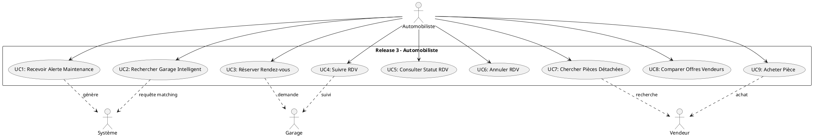
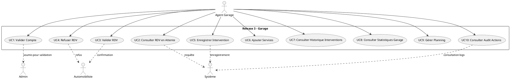
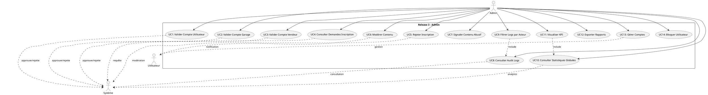
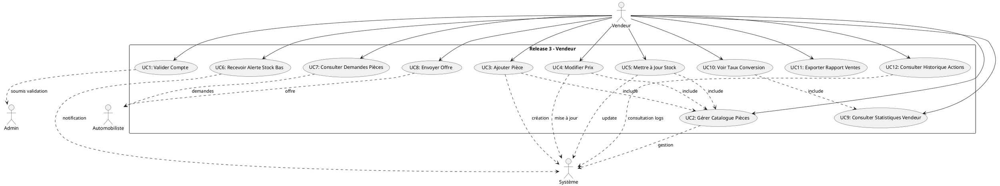

# Release 3 - Diagrammes de Cas d'Utilisation (Use Cases)

## 1. Automobiliste - Cas d'Utilisation

---

## 2. Garage - Cas d'Utilisation

---

## 3. Admin - Cas d'Utilisation

---

## 4. Vendeur - Cas d'Utilisation

---

## 5. Vue Globale - Tous les Acteurs

```plantuml
@startuml Release3_AllActors_UseCases
left to right direction

:Automobiliste: as Auto
:Garage: as Garage
:Vendeur: as Vendor
:Admin: as Admin
:Système: as System

rectangle "Release 3 - Gestion Rendez-vous" {
  usecase "Créer RDV" as RDV1
  usecase "Valider RDV" as RDV2
  usecase "Suivre RDV" as RDV3
  usecase "Annuler RDV" as RDV4
}

rectangle "Release 3 - Alertes & Matching" {
  usecase "Alerte Maintenance" as ALERT1
  usecase "Matching Garage" as MATCH1
  usecase "Alerte Stock Bas" as ALERT2
  usecase "Matching Pièces" as MATCH2
  usecase "Rechercher Pièces" as SEARCH1
}

rectangle "Release 3 - Validation Comptes" {
  usecase "Valider Compte Auto" as VAL1
  usecase "Valider Compte Garage" as VAL2
  usecase "Valider Compte Vendeur" as VAL3
  usecase "Rejeter Inscription" as VAL4
}

rectangle "Release 3 - Statistiques & KPI" {
  usecase "Consulter Stats Garage" as STAT1
  usecase "Consulter Stats Vendeur" as STAT2
  usecase "Dashboard KPI Global" as STAT3
  usecase "Exporter Rapport" as STAT4
}

rectangle "Release 3 - Audit & Modération" {
  usecase "Consulter Audit Logs" as AUDIT1
  usecase "Filtrer Logs" as AUDIT2
  usecase "Modérer Contenu" as MOD1
  usecase "Bloquer Utilisateur" as MOD2
}

Auto --> RDV1
Auto --> ALERT1
Auto --> MATCH1
Auto --> SEARCH1
Auto --> MATCH2

Garage --> RDV2
Garage --> STAT1
Garage --> AUDIT1
Garage --> VAL2

Vendor --> ALERT2
Vendor --> STAT2
Vendor --> AUDIT1
Vendor --> VAL3

Admin --> VAL1
Admin --> VAL2
Admin --> VAL3
Admin --> VAL4
Admin --> STAT3
Admin --> AUDIT1
Admin --> AUDIT2
Admin --> MOD1
Admin --> MOD2

System -.> RDV1
System -.> RDV2
System -.> RDV3
System -.> ALERT1
System -.> MATCH1
System -.> STAT1
System -.> STAT3
System -.> AUDIT1

note right of Auto
  **Flux Automobiliste:**
  1. Recevoir alerte maintenance
  2. Rechercher garage intelligent
  3. Créer RDV
  4. Suivre/annuler RDV
  5. Chercher pièces
  6. Comparer offres
end note

note right of Garage
  **Flux Garage:**
  1. Valider compte
  2. Valider/refuser RDV
  3. Enregistrer intervention
  4. Consulter statistiques
  5. Auditer actions
end note

note right of Vendor
  **Flux Vendeur:**
  1. Valider compte
  2. Gérer pièces
  3. Alertes stock
  4. Répondre demandes
  5. Consulter stats
end note

note right of Admin
  **Flux Admin:**
  1. Valider comptes
  2. Modérer contenu
  3. Audit logs
  4. KPI dashboard
  5. Gérer utilisateurs
end note
@enduml
```

---

## 6. Matrice de Relation - Cas d'Utilisation

| Use Case | Automobiliste | Garage | Vendeur | Admin |
|----------|:---:|:---:|:---:|:---:|
| **Validation Comptes** | - | ✅ | ✅ | ✅ |
| **Gestion RDV** | ✅ | ✅ | - | - |
| **Alertes Maintenance** | ✅ | - | - | - |
| **Alertes Stock** | - | - | ✅ | - |
| **Matching Garage** | ✅ | - | - | - |
| **Matching Pièces** | ✅ | - | ✅ | - |
| **Statistiques** | - | ✅ | ✅ | ✅ |
| **Audit Logs** | - | ✅ | ✅ | ✅ |
| **Modération** | - | - | - | ✅ |
| **KPI Global** | - | - | - | ✅ |

---

## Détail des Use Cases par Acteur

### **Automobiliste** (9 cas d'utilisation)
1. **Recevoir Alerte Maintenance** - Notification quand révision due
2. **Rechercher Garage** - Matching intelligent basé score
3. **Réserver Rendez-vous** - Créer RDV avec garage
4. **Suivre RDV** - Notifications avant RDV
5. **Consulter Statut RDV** - Vérifier confirmation
6. **Annuler RDV** - Annulation avant date
7. **Chercher Pièces** - Recherche intelligente
8. **Comparer Offres** - Comparer prix vendeurs
9. **Acheter Pièce** - Finaliser achat

### **Garage** (10 cas d'utilisation)
1. **Valider Compte** - Soumettre documents
2. **Consulter RDV en Attente** - Lister demandes
3. **Valider RDV** - Approuver RDV
4. **Refuser RDV** - Rejeter RDV
5. **Enregistrer Intervention** - Créer intervention
6. **Ajouter Services** - Gérer catalogue services
7. **Consulter Interventions** - Historique interventions
8. **Consulter Stats** - KPI garage (revenus, etc)
9. **Gérer Planning** - Calendrier RDV
10. **Consulter Audit** - Actions effectuées

### **Vendeur** (12 cas d'utilisation)
1. **Valider Compte** - Soumettre documents
2. **Gérer Catalogue** - CRUD pièces
3. **Ajouter Pièce** - Nouvelle pièce
4. **Modifier Prix** - Mettre à jour prix
5. **Mettre à Jour Stock** - Actualiser stock
6. **Recevoir Alerte Stock** - Notification stock bas
7. **Consulter Demandes** - Pièces recherchées
8. **Envoyer Offre** - Proposer prix/stock
9. **Consulter Stats** - KPI vendeur (ventes, vues)
10. **Voir Conversion** - Taux conversion
11. **Exporter Rapport** - PDF/CSV stats
12. **Consulter Audit** - Historique actions

### **Admin** (14 cas d'utilisation)
1. **Valider Compte Auto** - Approuver utilisateur
2. **Valider Compte Garage** - Approuver garage
3. **Valider Compte Vendeur** - Approuver vendeur
4. **Consulter Demandes** - Lister en attente
5. **Rejeter Inscription** - Motif rejet
6. **Modérer Contenu** - Approuver/supprimer
7. **Signaler Contenu** - Marquer abusif
8. **Consulter Logs** - Audit complet
9. **Filtrer Logs** - Par acteur/date/action
10. **Statistiques Globales** - Dashboard KPI
11. **Visualiser KPI** - Graphs statistiques
12. **Exporter Rapports** - Format PDF/CSV
13. **Gérer Comptes** - Activer/désactiver
14. **Bloquer Utilisateur** - Suspension compte

