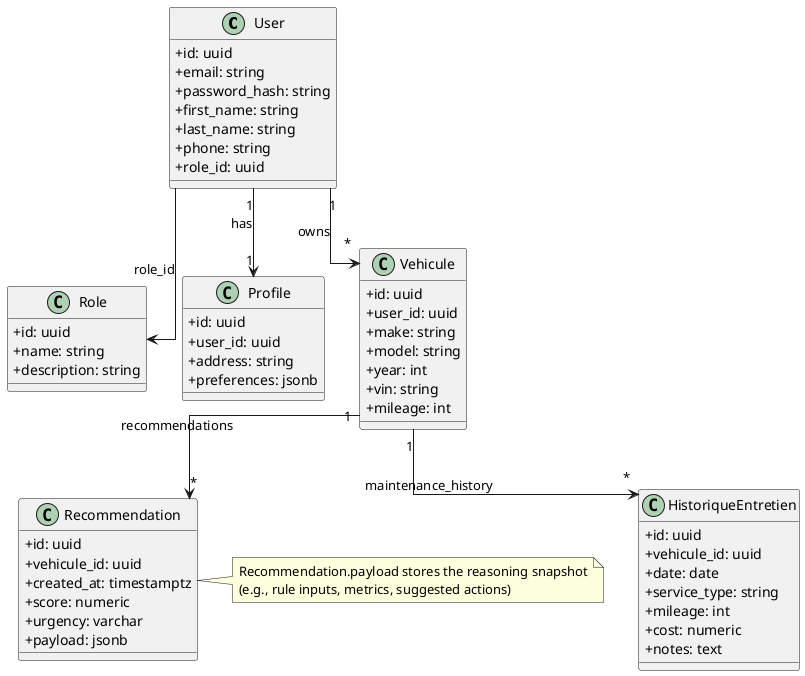
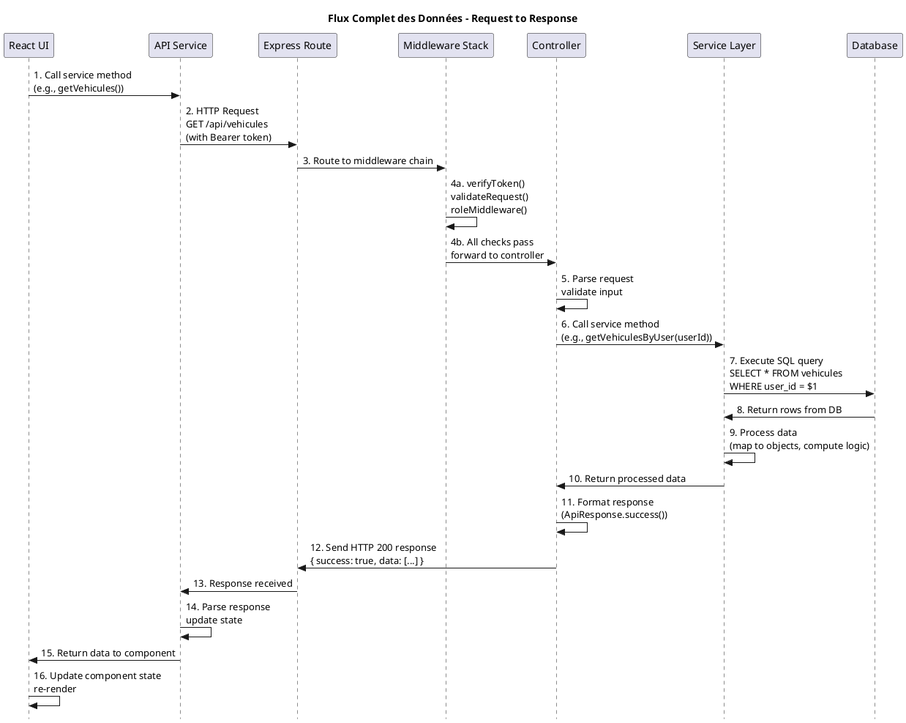
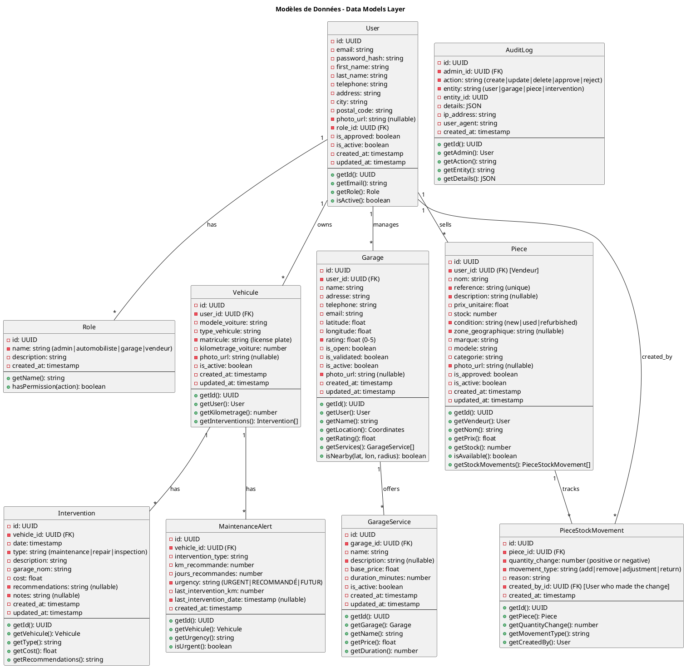
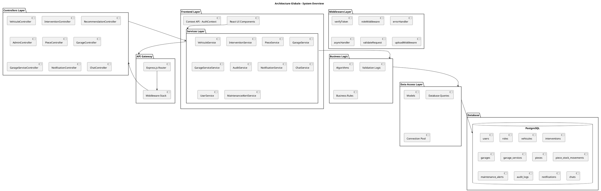
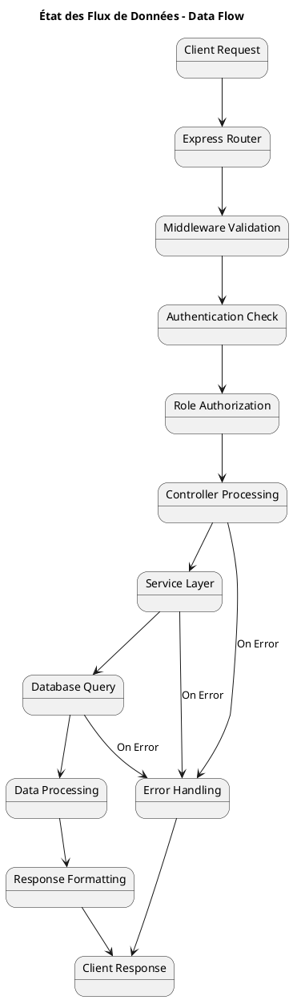

```plantuml
@startuml Controllers_Layer
skinparam Style strictuml
title "Contrôleurs - Controllers Layer"

abstract class BaseController {
  # req: Request
  # res: Response
  # logger: Logger
  --
  # validateRequest(): void
  # sendResponse(data, status): void
  # handleError(error): void
}

class VehiculeController extends BaseController {
  - vehiculeService: VehiculeService
  --
  + createVehicule(req, res): Promise<void>
  + getVehicules(req, res): Promise<void>
  + getVehiculeById(req, res): Promise<void>
  + updateVehicule(req, res): Promise<void>
  + deleteVehicule(req, res): Promise<void>
  - validateVehiculeData(data): boolean
  - uploadPhoto(file): string
}

class InterventionController extends BaseController {
  - interventionService: InterventionService
  --
  + createIntervention(req, res): Promise<void>
  + getInterventions(req, res): Promise<void>
  + getInterventionById(req, res): Promise<void>
  + updateIntervention(req, res): Promise<void>
  + deleteIntervention(req, res): Promise<void>
  + getInterventionsByVehicle(req, res): Promise<void>
}

class RecommendationController extends BaseController {
  - algorithms: Algorithms
  - interventionService: InterventionService
  --
  + getRecommendations(req, res): Promise<void>
  + classifyRecommendations(req, res): Promise<void>
  - calculateScores(vehicles, interventions): float[]
  - filterByUrgency(recommendations): Recommendation[]
  - paginateResults(data, page, limit): Object
}

class AdminController extends BaseController {
  - auditService: AuditService
  - userService: UserService
  --
  + updateProfile(req, res): Promise<void>
  + changePassword(req, res): Promise<void>
  + deleteAccount(req, res): Promise<void>
  + listPendingUsers(req, res): Promise<void>
  + approveUser(req, res): Promise<void>
  + rejectUser(req, res): Promise<void>
  + listPendingGarages(req, res): Promise<void>
  + approveGarage(req, res): Promise<void>
  + listPieces(req, res): Promise<void>
  + approvePiece(req, res): Promise<void>
  + getDashboardStats(req, res): Promise<void>
  + getAuditLogs(req, res): Promise<void>
}

class PieceController extends BaseController {
  - pieceService: PieceService
  - algorithms: Algorithms
  --
  + createPiece(req, res): Promise<void>
  + listPieces(req, res): Promise<void>
  + getPieceById(req, res): Promise<void>
  + updatePiece(req, res): Promise<void>
  + deletePiece(req, res): Promise<void>
  + comparePieces(req, res): Promise<void>
  + adjustPieceStock(req, res): Promise<void>
  + setPieceStock(req, res): Promise<void>
  + getPieceStockMovements(req, res): Promise<void>
  - validatePieceData(data): boolean
  - uploadPhoto(file): string
}

class GarageController extends BaseController {
  - garageService: GarageService
  - algorithms: Algorithms
  --
  + createGarage(req, res): Promise<void>
  + listGarages(req, res): Promise<void>
  + getGarageById(req, res): Promise<void>
  + getMyGarage(req, res): Promise<void>
  + updateGarage(req, res): Promise<void>
  + deleteGarage(req, res): Promise<void>
  + getFilterOptions(req, res): Promise<void>
  - filterByDistance(garages, lat, lon, radius): Garage[]
  - filterByServices(garages, services): Garage[]
  - filterByRating(garages, minRating): Garage[]
  - calculateDistance(lat1, lon1, lat2, lon2): float
}

class GarageServiceController extends BaseController {
  - garageServiceService: GarageServiceService
  --
  + createService(req, res): Promise<void>
  + listServices(req, res): Promise<void>
  + getServiceById(req, res): Promise<void>
  + updateService(req, res): Promise<void>
  + deleteService(req, res): Promise<void>
  + listServicesByGarage(req, res): Promise<void>
}

class NotificationController extends BaseController {
  - notificationService: NotificationService
  --
  + getNotifications(req, res): Promise<void>
  + markAsRead(req, res): Promise<void>
  + deleteNotification(req, res): Promise<void>
  + sendNotification(req, res): Promise<void>
}

class ChatController extends BaseController {
  - chatService: ChatService
  --
  + sendMessage(req, res): Promise<void>
  + getMessages(req, res): Promise<void>
  + getConversations(req, res): Promise<void>
  + deleteMessage(req, res): Promise<void>
}

VehiculeController -- VehiculeService
InterventionController -- InterventionService
RecommendationController -- Algorithms
AdminController -- AuditService
PieceController -- PieceService
PieceController -- Algorithms
GarageController -- GarageService
GarageController -- Algorithms
GarageServiceController -- GarageServiceService
NotificationController -- NotificationService
ChatController -- ChatService

@enduml
```

```plantuml
@startuml Services_Business_Logic
skinparam Style strictuml
title "Services & Utilities - Business Logic Layer"

abstract class BaseService {
  # logger: Logger
  # db: Database
  --
  # executeQuery(sql, params): Promise<Object>
  # handleError(error): void
}

class VehiculeService extends BaseService {
  --
  + createVehicule(userId, data): Promise<Vehicule>
  + getVehiculesByUser(userId): Promise<Vehicule[]>
  + getVehiculeById(vehiculeId): Promise<Vehicule>
  + updateVehicule(vehiculeId, data): Promise<Vehicule>
  + deleteVehicule(vehiculeId): Promise<boolean>
  + validateVehiculeData(data): boolean
}

class InterventionService extends BaseService {
  --
  + createIntervention(vehiculeId, data): Promise<Intervention>
  + getInterventionsByVehicle(vehiculeId): Promise<Intervention[]>
  + getInterventionById(interventionId): Promise<Intervention>
  + updateIntervention(interventionId, data): Promise<Intervention>
  + deleteIntervention(interventionId): Promise<boolean>
  + getLastInterventionByType(vehiculeId, type): Promise<Intervention>
}

class PieceService extends BaseService {
  --
  + createPiece(userId, data): Promise<Piece>
  + getPiecesByVendeur(userId): Promise<Piece[]>
  + getPieceById(pieceId): Promise<Piece>
  + updatePiece(pieceId, data): Promise<Piece>
  + deletePiece(pieceId): Promise<boolean>
  + adjustPieceStock(pieceId, quantity, reason): Promise<Piece>
  + setPieceStock(pieceId, quantity): Promise<Piece>
  + getPieceStockMovements(pieceId, pagination): Promise<PieceStockMovement[]>
  + comparePieces(pieces): Promise<ComparisonResult>
  + searchPieces(query, filters, pagination): Promise<Piece[]>
}

class GarageService extends BaseService {
  --
  + createGarage(userId, data): Promise<Garage>
  + getGarageById(garageId): Promise<Garage>
  + getGarageByUser(userId): Promise<Garage>
  + updateGarage(garageId, data): Promise<Garage>
  + deleteGarage(garageId): Promise<boolean>
  + listGarages(filters, pagination): Promise<Garage[]>
  + getGarageServices(garageId): Promise<GarageService[]>
}

class GarageServiceService extends BaseService {
  --
  + createService(garageId, data): Promise<GarageService>
  + getServiceById(serviceId): Promise<GarageService>
  + updateService(serviceId, data): Promise<GarageService>
  + deleteService(serviceId): Promise<boolean>
  + getServicesByGarage(garageId): Promise<GarageService[]>
}

class AuditService extends BaseService {
  --
  + logAction(adminId, action, entity, entityId, details, ip, userAgent): Promise<AuditLog>
  + getAuditLogs(pagination, filters): Promise<AuditLog[]>
  + getAuditLogsByEntity(entity, entityId): Promise<AuditLog[]>
  + getAuditLogsByAdmin(adminId): Promise<AuditLog[]>
}

class NotificationService extends BaseService {
  --
  + sendNotification(userId, title, message): Promise<Notification>
  + getNotifications(userId, pagination): Promise<Notification[]>
  + markAsRead(notificationId): Promise<boolean>
  + deleteNotification(notificationId): Promise<boolean>
}

class ChatService extends BaseService {
  --
  + sendMessage(senderId, recipientId, message): Promise<Chat>
  + getConversation(userId1, userId2): Promise<Chat[]>
  + getConversations(userId): Promise<ChatContact[]>
  + deleteMessage(messageId): Promise<boolean>
}

class UserService extends BaseService {
  --
  + getUserById(userId): Promise<User>
  + getUserByEmail(email): Promise<User>
  + listPendingUsers(): Promise<User[]>
  + approveUser(userId): Promise<User>
  + rejectUser(userId): Promise<User>
  + updateUser(userId, data): Promise<User>
  + deleteUser(userId): Promise<boolean>
}

class Algorithms {
  --
  + {static} calculateInterventionScore(vehicle, lastIntervention, type): float
  + {static} calculateGarageScore(userLat, userLon, garage): float
  + {static} getUrgency(kmActuel, kmRecommande): string
  + {static} haversine(lat1, lon1, lat2, lon2): float
  + {static} comparePieceFeatures(pieces): ComparisonMatrix
  + {static} calculatePriceDifference(pieces): PriceStats
  + {static} filterByDistance(garages, userLat, userLon, radius): Garage[]
  + {static} sortByScore(items, scoreField): Item[]
}

class MaintenanceAlertService extends BaseService {
  --
  + createAlert(vehiculeId, type, kmRecommande, joursRecommandes): Promise<MaintenanceAlert>
  + getAlertsByVehicule(vehiculeId): Promise<MaintenanceAlert[]>
  + getUrgentAlerts(vehiculeId): Promise<MaintenanceAlert[]>
  + updateAlertStatus(alertId, status): Promise<MaintenanceAlert>
}

VehiculeService -- Vehicule
InterventionService -- Intervention
PieceService -- Piece
PieceService -- PieceStockMovement
GarageService -- Garage
GarageServiceService -- GarageService
AuditService -- AuditLog
NotificationService -- Notification
ChatService -- Chat
UserService -- User
MaintenanceAlertService -- MaintenanceAlert
PieceService -- Algorithms
Algorithms -- Intervention
Algorithms -- Garage

@enduml
```

# UML Class Diagrams - PFE Saif Nouri
## Architecture en Couches - Excluding Auth Components

---

## RELEASE 1 - Diagramme de Classe Corrigé



' Recommandation intelligente
class RecommendationIntelligente {
  - id: int
  - type_recommandation: string
  - score: float
  - urgence: string
  - date_creation: date
  + calculerScore(): float
  + proposerEntretien(): void
}

' Relations corrigées selon la structure réelle
User "*" -- "1" Role : possède >
User "1" -- "*" Vehicule : possède >
Vehicule "1" -- "*" HistoriqueEntretien : contient >
Vehicule "1" -- "*" RecommendationIntelligente : reçoit >
AuthentificationService ..> User : authentifie
AuthentificationService ..> Role : vérifie

note right of Role
  Admin, Automobiliste,
  Vendeur, Garage
  sont des valeurs de rôle,
  pas des classes filles.
end note

note bottom of User
  Le profil est géré par User.
  Authentification = service,
  pas héritage.
end note

@enduml
```

## ARCHITECTURE STYLE - Layered Design Following Hand-Drawn Sketch

### PlantUML Code - Architectural Overview
```plantuml
@startuml Architecture_Style_Overview
skinparam Style strictuml
title "Architecture en Couches - Layered Design"

package "🖥️ PRESENTATION LAYER - Frontend (React + Vite)" {
  package "UI Components" {
    [Dashboard UI]
    [Forms & Controls]
    [List Views]
    [Detail Views]
  }
  
  package "State Management" {
    [AuthContext]
    [AppContext]
    [LocalStorage]
  }
  
  package "Services API" {
    [vehicule.js]
    [interventions.js]
    [pieces.js]
    [garages.js]
    [admin.js]
    [recommendation.js]
    [api.js - Axios Config]
  }
}

package "🌐 API GATEWAY LAYER - Express.js" {
  package "Routing & Middleware" {
    [Express Router]
    [verifyToken]
    [roleMiddleware]
    [errorHandler]
    [validateRequest]
    [uploadMiddleware]
  }
}

package "⚙️ BUSINESS LOGIC LAYER - Controllers & Services" {
  package "Controllers (Request Handlers)" {
    [VehiculeController]
    [InterventionController]
    [RecommendationController]
    [AdminController]
    [PieceController]
    [GarageController]
    [GarageServiceController]
    [NotificationController]
    [ChatController]
  }
  
  package "Services (Business Logic)" {
    [VehiculeService]
    [InterventionService]
    [PieceService]
    [GarageService]
    [GarageServiceService]
    [UserService]
    [AuditService]
    [MaintenanceAlertService]
    [Algorithms]
  }
}

package "📊 DATA LAYER - Models & Database" {
  package "Domain Models" {
    [User]
    [Role]
    [Vehicule]
    [Intervention]
    [Garage]
    [GarageService]
    [Piece]
    [PieceStockMovement]
    [MaintenanceAlert]
    [AuditLog]
    [Notification]
    [Chat]
  }
  
  package "Database - PostgreSQL" {
    database "PostgreSQL\n- users\n- roles\n- vehicules\n- interventions\n- garages\n- garage_services\n- pieces\n- piece_stock_movements\n- maintenance_alerts\n- audit_logs" {
    }
  }
}

%% Layer Connections
[UI Components] --> [Services API]
[State Management] --> [Services API]
[Services API] --> [Express Router]
[Express Router] --> [Controllers (Request Handlers)]
[Controllers (Request Handlers)] --> [Services (Business Logic)]
[Services (Business Logic)] --> [Domain Models]
[Domain Models] --> PostgreSQL

@enduml
```

---

## Architecture Détaillée - Par Couche

### PlantUML Code - Couche Présentation
```plantuml
@startuml Presentation_Layer
skinparam Style strictuml
title "COUCHE PRÉSENTATION - Frontend Layer"

package "React Components UI" {
  class "Dashboard.jsx" {
    - vehicules: Vehicule[]
    - interventions: Intervention[]
    - recommendations: Recommendation[]
    --
    + render(): JSX
    + loadData(): void
  }
  
  class "VehiculeForm.jsx" {
    - formData: FormData
    - isLoading: boolean
    --
    + handleSubmit(): void
    + handleChange(): void
    + render(): JSX
  }
  
  class "InterventionForm.jsx" {
    - vehicleId: UUID
    - formData: FormData
    --
    + handleSubmit(): void
    + render(): JSX
  }
  
  class "GarageFilter.jsx" {
    - filters: FilterOptions
    - results: Garage[]
    --
    + applyFilters(): void
    + render(): JSX
  }
  
  class "PiecesCatalog.jsx" {
    - pieces: Piece[]
    - searchTerm: string
    --
    + searchPieces(): void
    + filterPieces(): void
    + render(): JSX
  }
}

package "State Management" {
  class "AuthContext" {
    - user: User
    - token: string
    - isAuthenticated: boolean
    --
    + login(credentials): Promise<void>
    + logout(): void
    + getUser(): User
  }
  
  class "AppContext" {
    - vehicules: Vehicule[]
    - currentVehicule: Vehicule
    --
    + setVehicules(data): void
    + setCurrentVehicule(id): void
  }
}

package "API Services Layer" {
  class "api.js" {
    - axiosInstance: AxiosInstance
    - baseURL: string
    --
    + setAuthToken(token): void
    + get(url, config): Promise
    + post(url, data): Promise
    + put(url, data): Promise
    + delete(url): Promise
  }
  
  class "vehicule.js" {
    --
    + getVehicules(): Promise<Vehicule[]>
    + createVehicule(data): Promise<Vehicule>
    + updateVehicule(id, data): Promise<Vehicule>
    + deleteVehicule(id): Promise<boolean>
  }
  
  class "interventions.js" {
    --
    + listForVehicle(vehicleId): Promise<Intervention[]>
    + create(vehicleId, data): Promise<Intervention>
    + update(vehicleId, id, data): Promise<Intervention>
    + remove(vehicleId, id): Promise<boolean>
  }
  
  class "pieces.js" {
    --
    + getPieces(filters): Promise<Piece[]>
    + comparePieces(ids): Promise<Comparison>
    + adjustStock(id, quantity): Promise<Piece>
  }
  
  class "garages.js" {
    --
    + listGarages(filters): Promise<Garage[]>
    + getFilterOptions(): Promise<FilterOptions>
    + getMyGarage(): Promise<Garage>
  }
  
  class "recommendation.js" {
    --
    + getDynamicRecommendations(params): Promise<Recommendation[]>
    + classifyByUrgency(): Promise<Object>
  }
  
  class "admin.js" {
    --
    + updateProfile(data): Promise<User>
    + changePassword(old, new): Promise<boolean>
    + listPendingUsers(): Promise<User[]>
    + approveUser(id): Promise<boolean>
  }
}

%% Relationships in Presentation Layer
[VehiculeForm.jsx] --> [api.js]
[InterventionForm.jsx] --> [api.js]
[GarageFilter.jsx] --> [api.js]
[PiecesCatalog.jsx] --> [api.js]
[Dashboard.jsx] --> [AuthContext]
[Dashboard.jsx] --> [AppContext]
[AuthContext] --> [api.js]
[vehicule.js] --> [api.js]
[interventions.js] --> [api.js]
[pieces.js] --> [api.js]
[garages.js] --> [api.js]
[recommendation.js] --> [api.js]
[admin.js] --> [api.js]

@enduml
```

---

### PlantUML Code - Couche Contrôleurs & Middleware
```plantuml
@startuml Controller_Middleware_Layer
skinparam Style strictuml
title "COUCHE CONTRÔLEURS & MIDDLEWARE - Controller Layer"

package "Express Middleware Stack" {
  class "verifyToken" {
    --
    + execute(req, res, next): void
    + validateJWT(token): User
    + setUserContext(): void
  }
  
  class "roleMiddleware" {
    --
    + checkRole(roles): Middleware
    + execute(req, res, next): void
    + verifyPermission(): boolean
  }
  
  class "errorHandler" {
    --
    + execute(err, req, res, next): void
    + formatError(error): ErrorResponse
    + sendErrorResponse(): void
  }
  
  class "validateRequest" {
    --
    + validate(schema): Middleware
    + execute(req, res, next): void
    + checkValidationResult(): void
  }
  
  class "uploadMiddleware" {
    --
    + uploadSingle(fieldName): Middleware
    + validateFile(file): boolean
    + saveFile(): string
  }
}

package "Controllers (HTTP Handlers)" {
  class "VehiculeController" {
    - req: Request
    - res: Response
    --
    + createVehicule(): Promise<void>
    + getVehicules(): Promise<void>
    + getVehiculeById(): Promise<void>
    + updateVehicule(): Promise<void>
    + deleteVehicule(): Promise<void>
    - validateInput(): boolean
  }
  
  class "InterventionController" {
    --
    + createIntervention(): Promise<void>
    + getInterventions(): Promise<void>
    + updateIntervention(): Promise<void>
    + deleteIntervention(): Promise<void>
  }
  
  class "RecommendationController" {
    --
    + getRecommendations(): Promise<void>
    + classifyRecommendations(): Promise<void>
    - buildRecommendations(): void
  }
  
  class "PieceController" {
    --
    + createPiece(): Promise<void>
    + listPieces(): Promise<void>
    + updatePiece(): Promise<void>
    + deletePiece(): Promise<void>
    + comparePieces(): Promise<void>
    + adjustStock(): Promise<void>
  }
  
  class "GarageController" {
    --
    + listGarages(): Promise<void>
    + getMyGarage(): Promise<void>
    + updateGarage(): Promise<void>
    + getFilterOptions(): Promise<void>
  }
  
  class "GarageServiceController" {
    --
    + createService(): Promise<void>
    + listServices(): Promise<void>
    + updateService(): Promise<void>
    + deleteService(): Promise<void>
  }
  
  class "AdminController" {
    --
    + updateProfile(): Promise<void>
    + changePassword(): Promise<void>
    + listPendingUsers(): Promise<void>
    + approveUser(): Promise<void>
    + listGarages(): Promise<void>
    + approveGarage(): Promise<void>
  }
  
  class "NotificationController" {
    --
    + getNotifications(): Promise<void>
    + markAsRead(): Promise<void>
    + deleteNotification(): Promise<void>
  }
  
  class "ChatController" {
    --
    + sendMessage(): Promise<void>
    + getMessages(): Promise<void>
    + getConversations(): Promise<void>
  }
}

%% Middleware flow
[verifyToken] --> [roleMiddleware]
[roleMiddleware] --> [validateRequest]
[validateRequest] --> [uploadMiddleware]

%% Controller dependencies (all pass through middleware)
[uploadMiddleware] --> [VehiculeController]
[uploadMiddleware] --> [InterventionController]
[uploadMiddleware] --> [RecommendationController]
[uploadMiddleware] --> [PieceController]
[uploadMiddleware] --> [GarageController]
[uploadMiddleware] --> [GarageServiceController]
[uploadMiddleware] --> [AdminController]
[uploadMiddleware] --> [NotificationController]
[uploadMiddleware] --> [ChatController]

@enduml
```

---

### PlantUML Code - Couche Services & Business Logic
```plantuml
@startuml Services_Business_Logic_Layer
skinparam Style strictuml
title "COUCHE SERVICES - Business Logic Layer"

package "Business Logic Services" {
  abstract class "BaseService" {
    # logger: Logger
    # db: Database
    --
    # executeQuery(sql, params): Promise
    # handleError(error): void
  }
  
  class "VehiculeService" extends BaseService {
    --
    + createVehicule(userId, data): Promise<Vehicule>
    + getVehiculesByUser(userId): Promise<Vehicule[]>
    + updateVehicule(id, data): Promise<Vehicule>
    + deleteVehicule(id): Promise<boolean>
    - validateData(data): boolean
  }
  
  class "InterventionService" extends BaseService {
    --
    + createIntervention(vehiculeId, data): Promise<Intervention>
    + getInterventionsByVehicle(vehiculeId): Promise<Intervention[]>
    + updateIntervention(id, data): Promise<Intervention>
    + deleteIntervention(id): Promise<boolean>
    + getLastByType(vehiculeId, type): Promise<Intervention>
  }
  
  class "PieceService" extends BaseService {
    --
    + createPiece(userId, data): Promise<Piece>
    + getPiecesByVendeur(userId): Promise<Piece[]>
    + updatePiece(id, data): Promise<Piece>
    + deletePiece(id): Promise<boolean>
    + adjustStock(id, qty, reason): Promise<Piece>
    + searchPieces(query): Promise<Piece[]>
  }
  
  class "GarageService" extends BaseService {
    --
    + createGarage(userId, data): Promise<Garage>
    + listGarages(filters): Promise<Garage[]>
    + getGarageById(id): Promise<Garage>
    + updateGarage(id, data): Promise<Garage>
    + deleteGarage(id): Promise<boolean>
  }
  
  class "AuditService" extends BaseService {
    --
    + logAction(adminId, action, entity, data): Promise<AuditLog>
    + getAuditLogs(filters): Promise<AuditLog[]>
    + getLogsByAdmin(adminId): Promise<AuditLog[]>
  }
  
  class "UserService" extends BaseService {
    --
    + getUserById(id): Promise<User>
    + listPendingUsers(): Promise<User[]>
    + approveUser(id): Promise<User>
    + rejectUser(id): Promise<User>
    + updateUser(id, data): Promise<User>
  }
  
  class "MaintenanceAlertService" extends BaseService {
    --
    + createAlert(vehiculeId, data): Promise<MaintenanceAlert>
    + getAlertsByVehicule(vehiculeId): Promise<MaintenanceAlert[]>
    + getUrgentAlerts(vehiculeId): Promise<MaintenanceAlert[]>
  }
}

package "Utility Classes & Algorithms" {
  class "Algorithms" {
    --
    + {static} calculateInterventionScore(vehicle, lastIntervention, type): float
    + {static} calculateGarageScore(userLat, userLon, garage): float
    + {static} getUrgency(kmActuel, kmRecommande): string
    + {static} haversine(lat1, lon1, lat2, lon2): float
    + {static} comparePieceFeatures(pieces): Object
    + {static} calculatePriceDifference(pieces): Object
  }
  
  class "Logger" {
    --
    + {static} info(message): void
    + {static} error(message): void
    + {static} warn(message): void
    + {static} debug(message): void
  }
  
  class "ApiResponse" {
    --
    + {static} success(data, message): Object
    + {static} error(code, message): Object
    + {static} paginated(data, pagination): Object
  }
  
  class "Validator" {
    --
    + {static} validateEmail(email): boolean
    + {static} validatePhone(phone): boolean
    + {static} validateCoordinates(lat, lon): boolean
  }
}

%% Service relationships
[VehiculeService] --> [Algorithms]
[InterventionService] --> [Algorithms]
[PieceService] --> [Algorithms]
[GarageService] --> [Algorithms]
[AuditService] --> [Logger]
[UserService] --> [Logger]

@enduml
```

---

### PlantUML Code - Couche Données & Modèles
```plantuml
@startuml Data_Layer
skinparam Style strictuml
title "COUCHE DONNÉES - Data Models & Database Layer"

package "Domain Models" {
  class "User" {
    - id: UUID
    - email: string
    - password_hash: string
    - first_name: string
    - last_name: string
    - role_id: UUID
    - is_approved: boolean
    --
    + getId(): UUID
    + getEmail(): string
    + getRole(): Role
    + isActive(): boolean
  }
  
  class "Role" {
    - id: UUID
    - name: string
    - description: string
    --
    + getName(): string
    + hasPermission(action): boolean
  }
  
  class "Vehicule" {
    - id: UUID
    - user_id: UUID
    - modele_voiture: string
    - matricule: string
    - kilometrage_voiture: number
    --
    + getId(): UUID
    + getKilometrage(): number
    + getType(): string
  }
  
  class "Intervention" {
    - id: UUID
    - vehicle_id: UUID
    - date: timestamp
    - type: string
    - cost: float
    --
    + getId(): UUID
    + getType(): string
    + getCost(): float
  }
  
  class "Garage" {
    - id: UUID
    - user_id: UUID
    - name: string
    - latitude: float
    - longitude: float
    - rating: float
    --
    + getId(): UUID
    + getRating(): float
    + getLocation(): Coordinates
  }
  
  class "GarageService" {
    - id: UUID
    - garage_id: UUID
    - name: string
    - base_price: float
    --
    + getId(): UUID
    + getPrice(): float
  }
  
  class "Piece" {
    - id: UUID
    - user_id: UUID
    - nom: string
    - prix_unitaire: float
    - stock: number
    --
    + getId(): UUID
    + getPrix(): float
    + getStock(): number
  }
  
  class "PieceStockMovement" {
    - id: UUID
    - piece_id: UUID
    - quantity_change: number
    - movement_type: string
    --
    + getId(): UUID
    + getQuantityChange(): number
  }
  
  class "MaintenanceAlert" {
    - id: UUID
    - vehicle_id: UUID
    - urgency: string
    - km_recommande: number
    --
    + getUrgency(): string
    + isUrgent(): boolean
  }
  
  class "AuditLog" {
    - id: UUID
    - admin_id: UUID
    - action: string
    - entity: string
    --
    + getAction(): string
    + getEntity(): string
  }
}

package "Database - PostgreSQL" {
  database "Tables" {
    note right
      - users (id, email, password_hash, role_id, ...)
      - roles (id, name, description, ...)
      - vehicules (id, user_id, modele, km, ...)
      - interventions (id, vehicle_id, date, type, ...)
      - garages (id, user_id, name, lat, lon, rating, ...)
      - garage_services (id, garage_id, name, price, ...)
      - pieces (id, user_id, nom, prix, stock, ...)
      - piece_stock_movements (id, piece_id, qty_change, ...)
      - maintenance_alerts (id, vehicle_id, urgency, ...)
      - audit_logs (id, admin_id, action, entity, ...)
    end note
  }
}

%% Entity Relationships
User "1" -- "*" Vehicule: owns
User "1" -- "*" Garage: manages
User "1" -- "*" Piece: sells
Vehicule "1" -- "*" Intervention: has
Vehicule "1" -- "*" MaintenanceAlert: has
Garage "1" -- "*" GarageService: offers
Piece "1" -- "*" PieceStockMovement: tracks

@enduml
```

---

## Flux Complet des Données (Complete Data Flow)

### PlantUML Code - Data Flow End-to-End


---


## 1. Modèles de Données (Data Models Layer)

### PlantUML Code


---

## 2. Couche Contrôleurs (Controllers Layer)

### PlantUML Code


---

## 3. Couche Services & Utilities (Business Logic Layer)

### PlantUML Code


---

## 4. Architecture Globale (Global Architecture Overview)

### PlantUML Code


---

## 5. Relations & Dépendances Détaillées (Detailed Relationships)

### PlantUML Code
```plantuml
@startuml Detailed_Relationships
skinparam Style strictuml
title "Relations & Dépendances - Detailed Relationships"

class User {
  - id: UUID
  - email: string
  - role_id: UUID
}

class Role {
  - id: UUID
  - name: string
}

class Vehicule {
  - id: UUID
  - user_id: UUID
  - modele: string
}

class Intervention {
  - id: UUID
  - vehicle_id: UUID
  - type: string
  - cost: float
}

class MaintenanceAlert {
  - id: UUID
  - vehicle_id: UUID
  - km_recommande: number
}

class Garage {
  - id: UUID
  - user_id: UUID
  - latitude: float
  - longitude: float
  - rating: float
}

class GarageService {
  - id: UUID
  - garage_id: UUID
  - name: string
  - base_price: float
}

class Piece {
  - id: UUID
  - user_id: UUID
  - nom: string
  - prix_unitaire: float
  - stock: number
}

class PieceStockMovement {
  - id: UUID
  - piece_id: UUID
  - quantity_change: number
}

class AuditLog {
  - id: UUID
  - admin_id: UUID
  - action: string
}

class Notification {
  - id: UUID
  - user_id: UUID
  - title: string
}

class Chat {
  - id: UUID
  - sender_id: UUID
  - recipient_id: UUID
  - message: string
}

%% User Relationships
User "1" -- "*" Role: belongs_to
User "1" -- "*" Vehicule: owns
User "1" -- "*" Intervention: has
User "1" -- "*" Garage: manages
User "1" -- "*" Piece: sells (Vendeur)
User "1" -- "*" AuditLog: creates
User "1" -- "*" Notification: receives
User "1" -- "*" Chat: participates

%% Vehicule Relationships
Vehicule "1" -- "*" Intervention: has
Vehicule "1" -- "*" MaintenanceAlert: has

%% Intervention Relationships
Intervention "*" -- "1" Garage: at_garage (nullable)

%% Garage Relationships
Garage "1" -- "*" GarageService: offers
Garage "1" -- "*" Intervention: provides

%% Piece Relationships
Piece "1" -- "*" PieceStockMovement: tracks

%% Stocks Movements Relationships
PieceStockMovement "*" -- "1" User: created_by

%% Audit Relationships
AuditLog "*" -- "1" User: references

note right of User
  Roles: admin, automobiliste, 
  garage, vendeur
end note

note right of Vehicule
  Owned by automobiliste users
  Multiple interventions per vehicle
end note

note right of Piece
  Managed by vendeur users
  Stock tracked via movements
end note

note right of Garage
  Managed by garage users
  Multiple services offered
end note

@enduml
```

---

## 6. Diagramme de Classe - Modèle Complet (Complete Class Model)

### PlantUML Code
```plantuml
@startuml Complete_Class_Model
skinparam Style strictuml
title "Modèle de Classe Complet - Complete Class Model"

package "Domain Models" {
  class User {
    - id: UUID
    - email: string
    - password_hash: string
    - first_name: string
    - last_name: string
    - telephone: string
    - address: string
    - city: string
    - postal_code: string
    - photo_url: string (nullable)
    - role_id: UUID
    - is_approved: boolean
    - is_active: boolean
    - created_at: timestamp
    - updated_at: timestamp
    --
    + getId(): UUID
    + getEmail(): string
    + getFullName(): string
    + getRole(): Role
    + isApproved(): boolean
    + isActive(): boolean
    + hasPermission(action): boolean
  }

  class Role {
    - id: UUID
    - name: string
    - description: string
    - created_at: timestamp
    --
    + getName(): string
    + getPermissions(): string[]
  }

  class Vehicule {
    - id: UUID
    - user_id: UUID
    - modele_voiture: string
    - type_vehicule: string
    - matricule: string
    - kilometrage_voiture: number
    - photo_url: string (nullable)
    - is_active: boolean
    - created_at: timestamp
    - updated_at: timestamp
    --
    + getId(): UUID
    + getKilometrage(): number
    + getType(): string
    + isActive(): boolean
  }

  class Intervention {
    - id: UUID
    - vehicle_id: UUID
    - date: timestamp
    - type: string
    - description: string
    - garage_nom: string
    - cost: float
    - recommendations: string
    - notes: string
    - created_at: timestamp
    - updated_at: timestamp
    --
    + getId(): UUID
    + getType(): string
    + getCost(): float
    + getDate(): timestamp
  }

  class MaintenanceAlert {
    - id: UUID
    - vehicle_id: UUID
    - intervention_type: string
    - km_recommande: number
    - jours_recommandes: number
    - urgency: string
    - last_intervention_km: number
    - last_intervention_date: timestamp
    - created_at: timestamp
    --
    + getUrgency(): string
    + isUrgent(): boolean
  }

  class Garage {
    - id: UUID
    - user_id: UUID
    - name: string
    - adresse: string
    - telephone: string
    - email: string
    - latitude: float
    - longitude: float
    - rating: float
    - is_open: boolean
    - is_validated: boolean
    - is_active: boolean
    - photo_url: string
    - created_at: timestamp
    - updated_at: timestamp
    --
    + getId(): UUID
    + getLocation(): Coordinates
    + getRating(): float
    + isNearby(lat, lon, radius): boolean
    + getServices(): GarageService[]
  }

  class GarageService {
    - id: UUID
    - garage_id: UUID
    - name: string
    - description: string
    - base_price: float
    - duration_minutes: number
    - is_active: boolean
    - created_at: timestamp
    - updated_at: timestamp
    --
    + getId(): UUID
    + getPrice(): float
    + getDuration(): number
    + getName(): string
  }

  class Piece {
    - id: UUID
    - user_id: UUID
    - nom: string
    - reference: string
    - description: string
    - prix_unitaire: float
    - stock: number
    - condition: string
    - zone_geographique: string
    - marque: string
    - modele: string
    - categorie: string
    - photo_url: string
    - is_approved: boolean
    - is_active: boolean
    - created_at: timestamp
    - updated_at: timestamp
    --
    + getId(): UUID
    + getNom(): string
    + getPrix(): float
    + getStock(): number
    + isAvailable(): boolean
    + getReference(): string
  }

  class PieceStockMovement {
    - id: UUID
    - piece_id: UUID
    - quantity_change: number
    - movement_type: string
    - reason: string
    - created_by_id: UUID
    - created_at: timestamp
    --
    + getId(): UUID
    + getQuantityChange(): number
    + getMovementType(): string
  }

  class AuditLog {
    - id: UUID
    - admin_id: UUID
    - action: string
    - entity: string
    - entity_id: UUID
    - details: JSON
    - ip_address: string
    - user_agent: string
    - created_at: timestamp
    --
    + getId(): UUID
    + getAction(): string
    + getEntity(): string
    + getDetails(): JSON
  }

  class Notification {
    - id: UUID
    - user_id: UUID
    - title: string
    - message: string
    - type: string
    - is_read: boolean
    - created_at: timestamp
    --
    + getId(): UUID
    + getTitle(): string
    + isRead(): boolean
  }

  class Chat {
    - id: UUID
    - sender_id: UUID
    - recipient_id: UUID
    - message: string
    - is_read: boolean
    - created_at: timestamp
    --
    + getId(): UUID
    + getMessage(): string
    + isRead(): boolean
  }
}

package "Controllers" {
  class VehiculeController {
    + createVehicule(): void
    + getVehicules(): void
    + updateVehicule(): void
    + deleteVehicule(): void
  }

  class InterventionController {
    + createIntervention(): void
    + getInterventions(): void
    + updateIntervention(): void
    + deleteIntervention(): void
  }

  class RecommendationController {
    + getRecommendations(): void
    + classifyRecommendations(): void
  }

  class AdminController {
    + updateProfile(): void
    + changePassword(): void
    + listPendingUsers(): void
    + approveUser(): void
  }

  class PieceController {
    + createPiece(): void
    + listPieces(): void
    + updatePiece(): void
    + comparePieces(): void
    + adjustStock(): void
  }

  class GarageController {
    + listGarages(): void
    + getMyGarage(): void
    + updateGarage(): void
    + filterGarages(): void
  }

  class GarageServiceController {
    + createService(): void
    + listServices(): void
    + updateService(): void
    + deleteService(): void
  }

  class NotificationController {
    + getNotifications(): void
    + markAsRead(): void
    + deleteNotification(): void
  }

  class ChatController {
    + sendMessage(): void
    + getMessages(): void
    + getConversations(): void
  }
}

package "Services" {
  class VehiculeService {
    + createVehicule(): Promise<Vehicule>
    + getVehiculesByUser(): Promise<Vehicule[]>
    + updateVehicule(): Promise<Vehicule>
    + deleteVehicule(): Promise<boolean>
  }

  class InterventionService {
    + createIntervention(): Promise<Intervention>
    + getInterventionsByVehicle(): Promise<Intervention[]>
    + updateIntervention(): Promise<Intervention>
    + getLastInterventionByType(): Promise<Intervention>
  }

  class PieceService {
    + createPiece(): Promise<Piece>
    + getPiecesByVendeur(): Promise<Piece[]>
    + updatePiece(): Promise<Piece>
    + adjustStock(): Promise<Piece>
    + searchPieces(): Promise<Piece[]>
  }

  class GarageService {
    + createGarage(): Promise<Garage>
    + getGarageById(): Promise<Garage>
    + listGarages(): Promise<Garage[]>
    + updateGarage(): Promise<Garage>
  }

  class GarageServiceService {
    + createService(): Promise<GarageService>
    + listServices(): Promise<GarageService[]>
    + updateService(): Promise<GarageService>
    + deleteService(): Promise<boolean>
  }

  class AuditService {
    + logAction(): Promise<AuditLog>
    + getAuditLogs(): Promise<AuditLog[]>
  }

  class UserService {
    + getUserById(): Promise<User>
    + listPendingUsers(): Promise<User[]>
    + approveUser(): Promise<User>
    + updateUser(): Promise<User>
  }
}

package "Utilities" {
  class Algorithms {
    + {static} calculateInterventionScore(): float
    + {static} calculateGarageScore(): float
    + {static} getUrgency(): string
    + {static} haversine(): float
    + {static} comparePieceFeatures(): Object
  }

  class Logger {
    + {static} info(): void
    + {static} error(): void
    + {static} warn(): void
  }

  class ApiResponse {
    + {static} success(): Object
    + {static} error(): Object
  }
}

%% Relationships
User "1" -- "*" Vehicule: owns
User "1" -- "*" Intervention: has
User "1" -- "*" Garage: manages
User "1" -- "*" Piece: sells
Vehicule "1" -- "*" Intervention: has
Vehicule "1" -- "*" MaintenanceAlert: has
Garage "1" -- "*" GarageService: offers
Piece "1" -- "*" PieceStockMovement: tracks
Chat "*" -- "1" User: involves

VehiculeController -- VehiculeService
InterventionController -- InterventionService
PieceController -- PieceService
GarageController -- GarageService
AdminController -- AuditService
AdminController -- UserService
PieceService -- Algorithms
GarageService -- Algorithms

@enduml
```

---

## 7. État des Flux de Données (Data Flow State)

### PlantUML Code


---

## Résumé des Relations de Classes

| From | To | Relationship | Cardinality | Description |
|------|-----|-------------|-------------|------------|
| User | Role | has | 1:N | Un utilisateur a un rôle, un rôle pour plusieurs utilisateurs |
| User | Vehicule | owns | 1:N | Un automobiliste possède plusieurs véhicules |
| User | Garage | manages | 1:N | Un garage owner gère un garage |
| User | Piece | sells | 1:N | Un vendeur vend plusieurs pièces |
| User | Intervention | has | 1:N | Un automobiliste a plusieurs interventions |
| User | AuditLog | creates | 1:N | Un admin crée plusieurs logs d'audit |
| User | Notification | receives | 1:N | Un utilisateur reçoit plusieurs notifications |
| User | Chat | participates | 1:N | Un utilisateur participe à plusieurs conversations |
| Vehicule | Intervention | has | 1:N | Un véhicule a plusieurs interventions |
| Vehicule | MaintenanceAlert | has | 1:N | Un véhicule a plusieurs alertes maintenance |
| Garage | GarageService | offers | 1:N | Un garage offre plusieurs services |
| Garage | Intervention | provides | 1:N | Un garage fournit plusieurs interventions |
| Piece | PieceStockMovement | tracks | 1:N | Une pièce a un historique de mouvements stock |
| VehiculeController | VehiculeService | uses | 1:1 | Le contrôleur utilise le service |
| InterventionController | InterventionService | uses | 1:1 | Le contrôleur utilise le service |
| PieceController | PieceService | uses | 1:1 | Le contrôleur utilise le service |
| GarageController | GarageService | uses | 1:1 | Le contrôleur utilise le service |
| Controllers | Algorithms | uses | N:1 | Les contrôleurs utilisent les algorithmes |
| Services | Algorithms | uses | N:1 | Les services utilisent les algorithmes |

---

## Exclusions Expliquées

### ❌ Auth Components NOT Included (Excluded as Per User Request)
- **AuthController**: Not included - manages login/register only
- **AuthService**: Not included - handles JWT token generation
- **authMiddleware.js**: Mentioned but not detailed in class diagrams
- **Reason**: User specifically requested exclusion of authentication layer

### ✅ All Other Components Included
- ✅ 7 Domain Models (User, Vehicule, Intervention, Garage, GarageService, Piece, MaintenanceAlert, AuditLog, Notification, Chat)
- ✅ 9 Controllers (excluding AuthController)
- ✅ 8 Services (excluding AuthService)
- ✅ Algorithms utility class with 5 core algorithms
- ✅ All relationships and dependencies

---

## Export Instructions

### To render PlantUML diagrams:
```bash
# Via planttext.com
1. Copy PlantUML code blocks
2. Visit https://www.planttext.com/
3. Paste code → Render as PNG/SVG

# Via local installation
npm install -g plantuml
plantuml UML_CLASS_DIAGRAMS.md -o output/
```

### VS Code Integration:
- Install "PlantUML" extension by jebbs
- Preview `.md` files with diagrams directly

---

**Generated:** May 9, 2026 | Project: pfe_Saif_Nouri  
**Architecture:** Layered Architecture (Couches en Couches)  
**Format:** PlantUML with skinparam Style strictuml
