# 11 Features - UML Sequence Diagrams

## 1. Authentification Utilisateur

### PlantUML Code
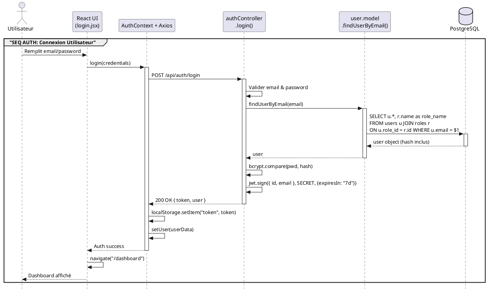

**Key Files:**
- Frontend: `frontend/src/pages/auth/login.jsx`, `frontend/src/context/AuthContext.jsx`, `frontend/src/services/api.js`
- Backend: `backend/controllers/authController.js`, `backend/models/user.model.js`
- Middleware: `backend/middlewares/authMiddleware.js` (utilisé pour `/api/auth/profile`, pas pour `/api/auth/login`)

**Validations:**
- express-validator chains on `/auth/register`
- bcrypt hash validation in `authController.login()`
- JWT token expiry: 7 days

---

## 2. CRUD Véhicule (CREATE Example)

### PlantUML Code
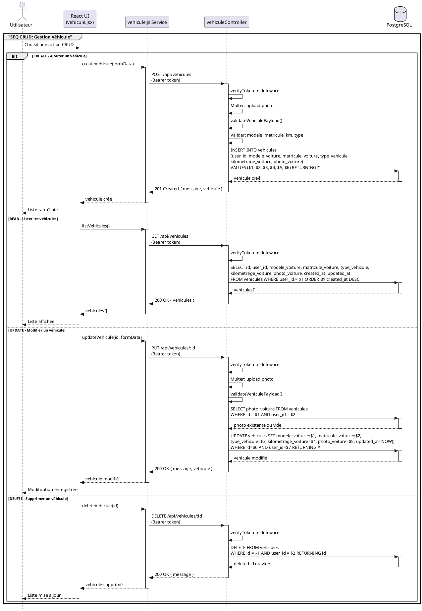

**Key Files:**
- Frontend: `frontend/src/services/vehicule.js`
- Backend: `backend/routes/vehicules.js`, `backend/controllers/vehiculeController.js`
- Middleware: `backend/middlewares/uploadVehiculePhoto.js`

**Validations:**
- vehiculePayload: modele, matricule (required), km (positive), type (enum)
- Photo upload: max size, allowed types via Multer

**All CRUD Operations:**
- CREATE: POST /api/vehicules
- READ: GET /api/vehicules (list), GET /api/vehicules/:id (single)
- UPDATE: PUT /api/vehicules/:id
- DELETE: DELETE /api/vehicules/:id

---

## 3. Historique d'Entretien (Intervention CREATE)

### PlantUML Code
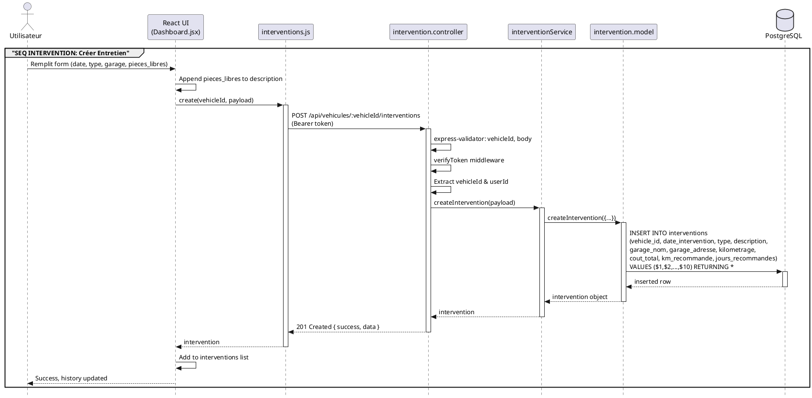

**Key Files:**
- Frontend: `frontend/src/services/interventions.js`, `frontend/src/pages/automobiliste/Dashboard.jsx`
- Backend: `backend/routes/interventions.js`, `backend/controllers/intervention.controller.js`
- Service: `backend/services/interventionService.js`
- Model: `backend/models/intervention.model.js`

**Validations:**
- vehicleId: positive integer (param validation)
- date_intervention: ISO8601 format
- type, description: string lengths
- Cost/km: positive floats/ints

**Free-Text Parts:**
- User enters `pieces_libres` → appended to `description` field before DB insert
- No schema change required

**All Intervention CRUD:**
- CREATE: POST /api/vehicules/:vehicleId/interventions
- LIST: GET /api/vehicules/:vehicleId/interventions
- GET: GET /api/vehicules/:vehicleId/interventions/:id
- UPDATE: PATCH /api/vehicules/:vehicleId/interventions/:id
- DELETE: DELETE /api/vehicules/:vehicleId/interventions/:id

---

## 4. Recommandation Intelligente

### PlantUML Code
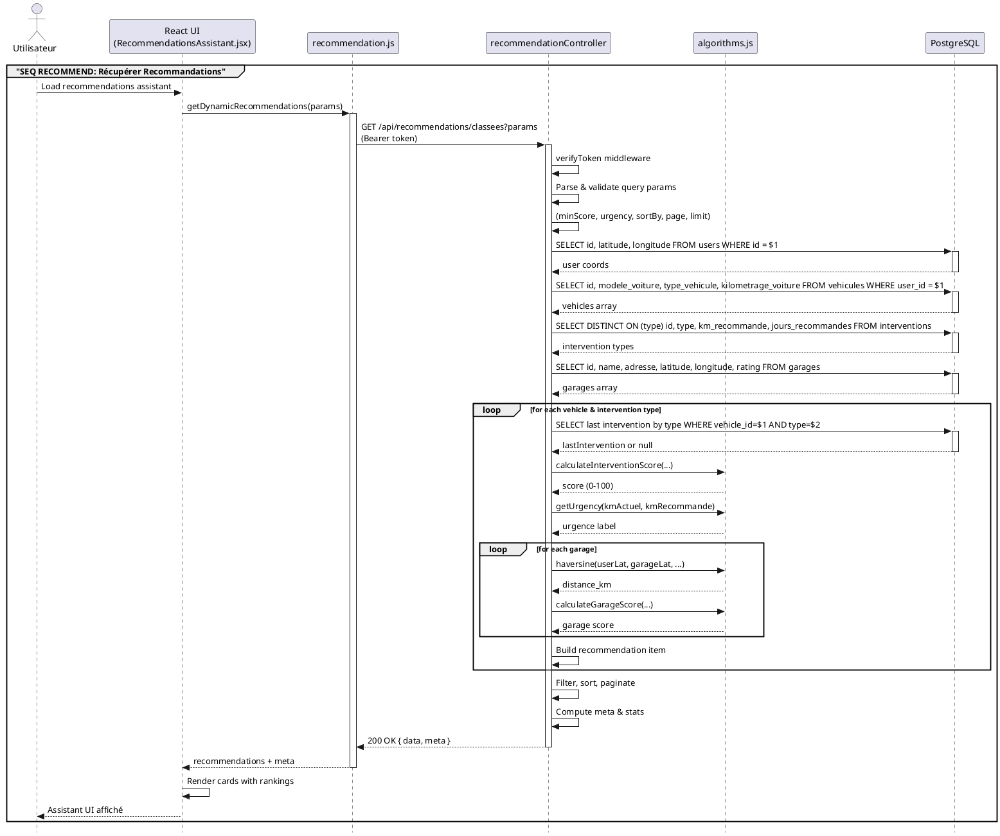

**Key Files:**
- Frontend: `frontend/src/services/recommendation.js`, `frontend/src/pages/automobiliste/RecommendationsAssistant.jsx`
- Backend: `backend/controllers/recommendationController.js`, `backend/utils/algorithms.js`
- Route: `backend/routes/recommendations.js`

**Scoring Algorithms** (in `algorithms.js`):
- `calculateInterventionScore(vehicle, lastIntervention, interventionType)`: returns 0-100 based on km and time since last intervention
- `calculateGarageScore(userLat, userLon, garage)`: combines distance, rating, availability
- `getUrgency(kmActuel, kmRecommande)`: returns "URGENT", "RECOMMANDÉ", or "FUTUR"
- `haversine(lat1, lon1, lat2, lon2)`: calculates distance in km between coordinates

**Query Parameters:**
- `minInterventionScore`: (0-100, default 0)
- `urgency`: URGENT | RECOMMANDÉ | FUTUR
- `sortBy`: urgence | score | distance | type (default: urgence)
- `order`: asc | desc (default: desc)
- `garageLimit`: (1-10, default 5)
- `page`: (>=1, default 1)
- `limit`: (1-50, default 10)

**Response Structure:**
```json
{
  "success": true,
  "data": [
    {
      "vehicle": { "id", "modele", "kilometrage", "type", "matricule" },
      "intervention": { "id", "type", "urgence", "score", "km_recommande", "km_actuel", "km_restant", "jours_recommandes" },
      "garages": [ { "id", "name", "adresse", "distance_km", "rating", "score_global", "isOpen" } ]
    }
  ],
  "count": 5,
  "meta": {
    "total": 15,
    "page": 1,
    "limit": 10,
    "totalPages": 2,
    "sortBy": "urgence",
    "order": "desc",
    "filters": { "urgency": null, "minInterventionScore": 0 },
    "stats": { "byUrgency": { "URGENT": 3, "RECOMMANDÉ": 7, "FUTUR": 5 } }
  }
}
```

---

## 5. Gestion Profil Admin - Opérations Profil

### PlantUML Code
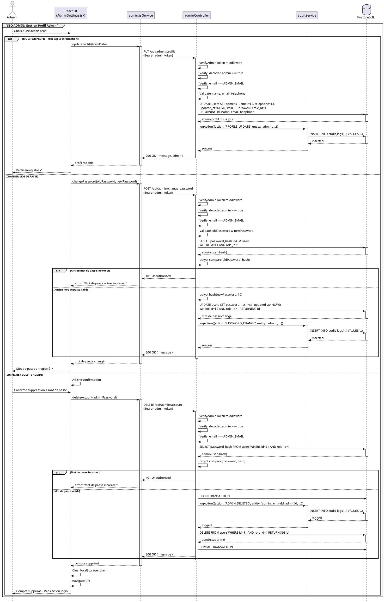

**Key Files:**
- Frontend: `frontend/src/services/admin.js`, `frontend/src/pages/admin/AdminSettings.jsx`
- Backend: `backend/controllers/adminController.js`, `backend/routes/admin.js`
- Middleware: `backend/middlewares/adminAuthMiddleware.js`
- Service: `backend/services/auditService.js`

**Admin Profile Operations:**

**Profile Management:**
- PUT /api/admin/profile → `updateProfile()` (name, email, telephone)
- POST /api/admin/change-password → `changePassword()` (oldPassword, newPassword)
- DELETE /api/admin/account → `deleteAccount()` (password confirmation required)

**User Management:**
- GET /api/admin/users/pending → `listPendingUsers()`
- POST /api/admin/users/:id/approve → `approveUser()`
- POST /api/admin/users/:id/reject → `rejectUser()`

**Garage Management:**
- GET /api/admin/garages → `listGarages()`
- POST /api/admin/garages/:id/approve → `approveGarage()`
- POST /api/admin/garages/:id/reject → `rejectGarage()`
- POST /api/admin/garages/:id/deactivate → `deactivateGarage()`
- DELETE /api/admin/garages/:id → `deleteGarageAdmin()`

**Piece Management:**
- GET /api/admin/pieces → `listPieces()`
- POST /api/admin/pieces/:id/approve → `approvePiece()`
- POST /api/admin/pieces/:id/reject → `rejectPiece()`
- DELETE /api/admin/pieces/:id → `deletePieceAdmin()`

**Reports & Audit:**
- GET /api/admin/stats → `getDashboardStats()`
- GET /api/admin/audit-logs → `listAuditLogs()`

**Admin Authentication:**
- Environment variables: `ADMIN_EMAIL`, `ADMIN_PASSWORD`
- Default: `admin123@gmail.com` / `Admin@admin0`
- JWT payload includes `{ admin: true, email: ADMIN_EMAIL }`
- Token expiry: 7 days

**Audit Logging:**
- Every admin action calls `logAction()` with: adminEmail, action, entity, entityId, details, ip, userAgent
- Inserted into `audit_logs` table for full compliance trail
- Profile updates, password changes, and account deletion are all logged

---

## Summary: Key Lifelines for All 11 Features

| Feature | Frontend Service | API Route | Controller | Model/Service | DB Query |
|---------|------------------|-----------|------------|---------------|----------|
| **Auth** | AuthContext.login() | POST /api/auth/login | authController.login() | user.model.findUserByEmail() | SELECT users JOIN roles |
| **Vehicle CRUD** | vehicule.js | POST/GET/PUT/DELETE /vehicules | vehiculeController | Direct SQL in controller | INSERT/SELECT/UPDATE/DELETE vehicules |
| **Intervention** | interventions.js | POST/GET/PATCH/DELETE /vehicules/:id/interventions | intervention.controller | interventionService → intervention.model | INSERT/SELECT/UPDATE/DELETE interventions |
| **Recommendation** | recommendation.js | GET /recommendations/classees | recommendationController | algorithms.js scoring | SELECT users, vehicules, interventions, garages |
| **Admin Profile** | admin.js | PUT/POST/DELETE /admin/* | adminController | auditService | UPDATE/DELETE users, INSERT audit_logs |
| **Pieces Catalog** | pieces.js | GET /api/pieces | pieceController | Direct SQL in controller | SELECT pieces (search, filter, sort, paginate) |
| **Pieces Compare** | pieces.js | GET /api/pieces/compare | pieceController | algorithms.js comparison | SELECT pieces (similar items, pricing analysis) |
| **Garage Filters** | garages.js | GET /api/garages | garageController | algorithms.js (haversine) | SELECT garages (distance calc, service match) |
| **Garage Profile** | garages.js | GET/PUT /api/garages/me | garageController | Direct SQL in controller | SELECT/UPDATE garages (garage owner) |
| **Garage Services** | garageServices.js | GET/POST/PUT/DELETE /api/garages/:id/services | garageServiceController | Direct SQL in controller | INSERT/SELECT/UPDATE/DELETE garage_services |
| **Seller Pieces Management** | pieces.js | GET/POST/PUT/DELETE /api/pieces + stock routes | pieceController | pieceService | SELECT/INSERT/UPDATE/DELETE pieces, stock movements |

---

## 6. Automobiliste — Catalogue Pièces

### PlantUML Code
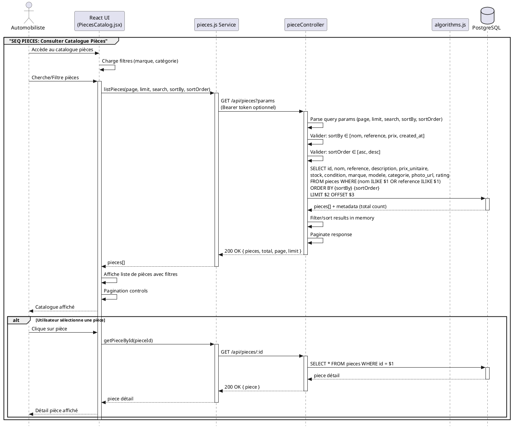

**Key Files:**
- Frontend: `frontend/src/services/pieces.js`, `frontend/src/pages/automobiliste/PiecesCatalog.jsx`
- Backend: `backend/routes/piece.routes.js`, `backend/controllers/piece.controller.js`

**Piece Catalog Operations:**
- GET /api/pieces → `listPieces()` (pagination, search, sort, filter)
- GET /api/pieces/:id → `getPieceById()` (détail pièce)
- GET /api/pieces/compare → `comparePieces()` (comparaison intelligente)

**Query Parameters:**
- `page`: (>=1, default 1)
- `limit`: (1-100, default 10)
- `search`: (texte libre pour nom/reference)
- `sortBy`: nom | reference | prix_unitaire | created_at
- `sortOrder`: asc | desc

---

## 7. Automobiliste — Comparaison Intelligente Pièces

### PlantUML Code
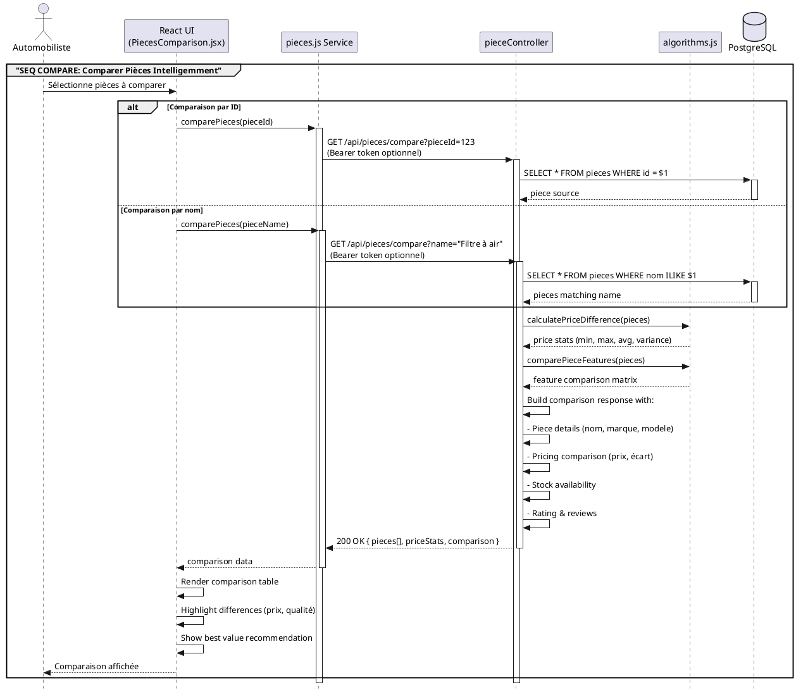

**Key Files:**
- Frontend: `frontend/src/services/pieces.js`, `frontend/src/pages/automobiliste/PiecesComparison.jsx`
- Backend: `backend/controllers/piece.controller.js`, `backend/utils/algorithms.js`

**Comparison Features:**
- Compare by pieceId (exact match)
- Compare by name (similar pieces search)
- Price range analysis
- Stock availability comparison
- Quality & condition scoring
- Value-for-money recommendation

---

## 8. Automobiliste — Filtrage Intelligent Garages

### PlantUML Code
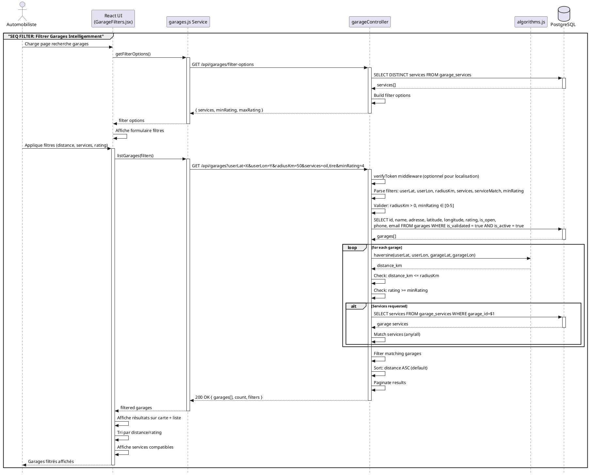

**Key Files:**
- Frontend: `frontend/src/services/garages.js`, `frontend/src/pages/automobiliste/GarageFilters.jsx`
- Backend: `backend/controllers/garage.controller.js`, `backend/utils/algorithms.js`

**Filter Parameters:**
- `userLat`, `userLon`: User location for distance calculation
- `radiusKm`: Search radius (1-500 km, default 50)
- `services`: Comma-separated service names
- `serviceMatch`: any | all (default: any)
- `minRating`: 0-5 (default: 0)
- `maxRating`: 0-5 (default: 5)
- `includeClosed`: Include closed garages (true/false)

---

## 9. Garage — Consultation et Modification Profil

### PlantUML Code
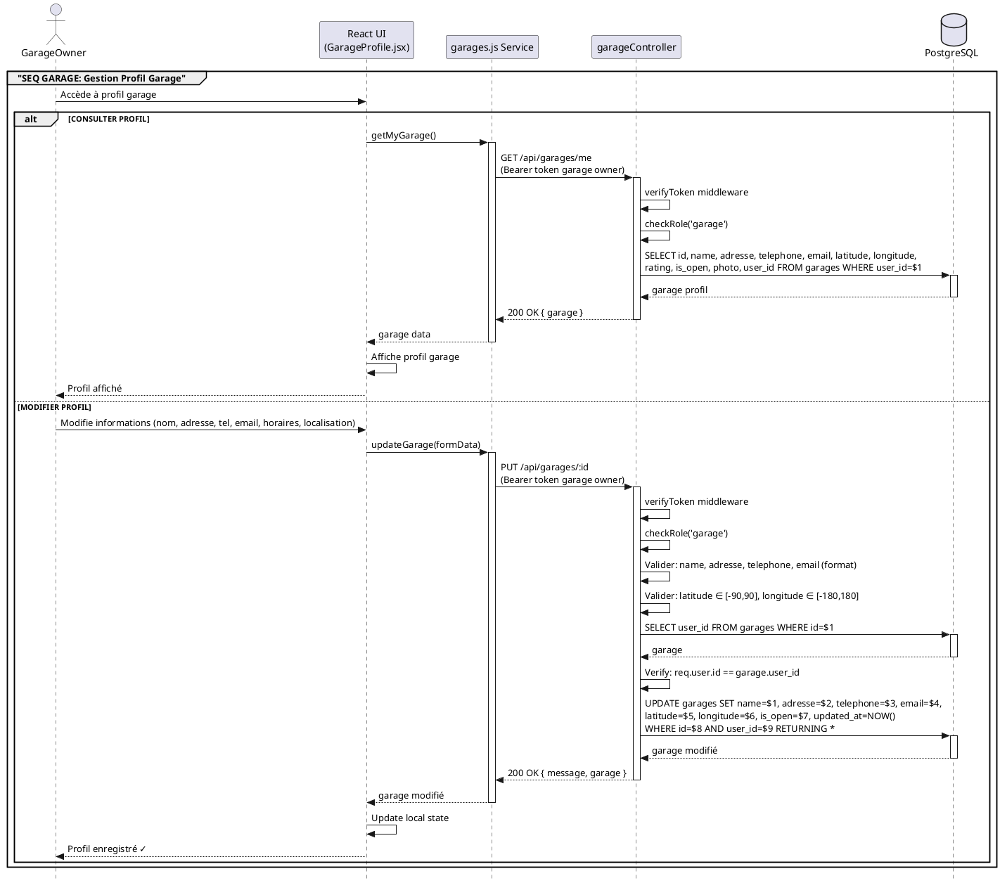

**Key Files:**
- Frontend: `frontend/src/services/garages.js`, `frontend/src/pages/garage/GarageProfile.jsx`
- Backend: `backend/routes/garage.routes.js`, `backend/controllers/garage.controller.js`

**Garage Profile Operations:**
- GET /api/garages/me → `getMyGarage()` (consultation profil)
- PUT /api/garages/:id → `updateGarage()` (modification profil)
- GET /api/garages/:id/reviews → `listGarageReviews()` (avis clients)
- GET /api/garages/:id/availability → `getAvailability()` (disponibilités)

**Editable Fields:**
- name, adresse, telephone, email
- latitude, longitude (GPS position)
- is_open (horaires ouvert/fermé)
- rating (géré par les clients via reviews)

---

## 10. Garage — Gestion Catalogue Services

### PlantUML Code
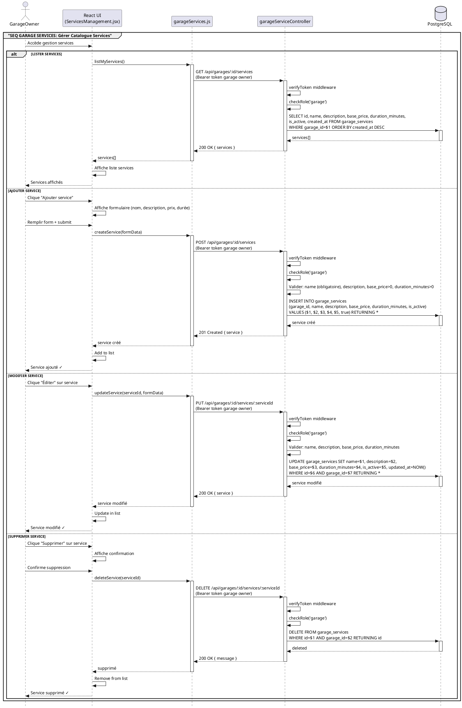

**Key Files:**
- Frontend: `frontend/src/services/garageServices.js`, `frontend/src/pages/garage/ServicesManagement.jsx`
- Backend: `backend/routes/garage.routes.js`, `backend/controllers/garageService.controller.js`

**Service Management Operations:**
- GET /api/garages/:id/services → `listGarageServices()` (lister services)
- POST /api/garages/:id/services → `createService()` (ajouter service)
- PUT /api/garages/:id/services/:serviceId → `updateService()` (modifier service)
- DELETE /api/garages/:id/services/:serviceId → `deleteService()` (supprimer service)

**Service Fields:**
- name: String (required, max 255)
- description: Text (optional)
- base_price: Float (required, > 0)
- duration_minutes: Int (required, 1-10080)
- is_active: Boolean (default: true)

---

## 11. Vendeur — Gestion du Catalogue Pièces

### PlantUML Code
```plantuml
@startuml Vendeur_Gestion_Catalogue_Pieces
skinparam Style strictuml

group "SEQ PIECES: Gestion Catalogue Vendeur"

actor "Vendeur" as Seller
participant "React UI\n(SellerPiecesManagement.jsx)" as UI
participant "pieces.js Service" as Service
participant "pieceController" as Ctrl
participant "pieceService" as PService
database "PostgreSQL" as DB

Seller -> UI: Accède à la gestion du catalogue

alt LISTER CATALOGUE
  UI -> Service: listPieces(page, limit, search, sortBy, sortOrder)
  activate Service
  Service -> Ctrl: GET /api/pieces?params
  activate Ctrl
  Ctrl -> Ctrl: Parse query params
  Ctrl -> Ctrl: Valider page, limit, search, sortBy, sortOrder
  Ctrl -> PService: getPieces(filters)
  activate PService
  PService -> DB: SELECT id, nom, reference, description, prix_unitaire, stock,\ncondition, marque, modele, categorie, photo_url, created_at\nFROM pieces WHERE user_id = $1\nORDER BY created_at DESC LIMIT $2 OFFSET $3
  activate DB
  DB --> PService: pieces[]
  deactivate DB
  PService --> Ctrl: catalogue pièces
  deactivate PService
  Ctrl --> Service: 200 OK { pieces }
  deactivate Ctrl
  Service --> UI: pieces[]
  deactivate Service
  UI --> Seller: Catalogue affiché

else AJOUTER PIECE
  Seller -> UI: Remplit form (nom, reference, prix, stock, photo)
  UI -> Service: createPiece(formData)
  activate Service
  Service -> Ctrl: POST /api/pieces\n(Bearer vendeur token)
  activate Ctrl
  Ctrl -> Ctrl: verifyToken middleware
  Ctrl -> Ctrl: isVendeurOrAdmin
  Ctrl -> Ctrl: uploadPiecePhoto.single('photo_piece')
  Ctrl -> Ctrl: validate createPieceValidation
  Ctrl -> PService: createPiece(payload)
  activate PService
  PService -> DB: INSERT INTO pieces\n(user_id, nom, reference, description, prix_unitaire, stock, photo_url)\nVALUES ($1,$2,$3,$4,$5,$6,$7) RETURNING *
  activate DB
  DB --> PService: piece créée
  deactivate DB
  PService --> Ctrl: piece
  deactivate PService
  Ctrl --> Service: 201 Created { piece }
  deactivate Ctrl
  Service --> UI: piece créée
  deactivate Service
  UI --> Seller: Pièce ajoutée ✓

else MODIFIER PIECE
  Seller -> UI: Ouvre une pièce et modifie les champs
  UI -> Service: updatePiece(id, formData)
  activate Service
  Service -> Ctrl: PUT /api/pieces/:id\n(Bearer vendeur token)
  activate Ctrl
  Ctrl -> Ctrl: verifyToken middleware
  Ctrl -> Ctrl: isVendeurOrAdmin
  Ctrl -> Ctrl: uploadPiecePhoto.single('photo_piece')
  Ctrl -> Ctrl: validate updatePieceValidation
  Ctrl -> PService: updatePiece(pieceId, payload)
  activate PService
  PService -> DB: UPDATE pieces SET nom=$1, reference=$2, description=$3,\nprix_unitaire=$4, stock=$5, condition=$6, zone_geographique=$7,\nmarque=$8, modele=$9, categorie=$10, photo_url=$11, updated_at=NOW()\nWHERE id=$12 RETURNING *
  activate DB
  DB --> PService: piece mise à jour
  deactivate DB
  PService --> Ctrl: piece
  deactivate PService
  Ctrl --> Service: 200 OK { piece }
  deactivate Ctrl
  Service --> UI: piece mise à jour
  deactivate Service
  UI --> Seller: Modification enregistrée

else SUPPRIMER PIECE
  Seller -> UI: Clique supprimer puis confirme
  UI -> Service: deletePiece(id)
  activate Service
  Service -> Ctrl: DELETE /api/pieces/:id\n(Bearer vendeur token)
  activate Ctrl
  Ctrl -> Ctrl: verifyToken middleware
  Ctrl -> Ctrl: isVendeurOrAdmin
  Ctrl -> Ctrl: validate piece id
  Ctrl -> PService: deletePiece(pieceId)
  activate PService
  PService -> DB: DELETE FROM pieces WHERE id=$1 RETURNING id
  activate DB
  DB --> PService: piece supprimée
  deactivate DB
  PService --> Ctrl: deleted
  deactivate PService
  Ctrl --> Service: 200 OK { message }
  deactivate Ctrl
  Service --> UI: piece supprimée
  deactivate Service
  UI --> Seller: Catalogue mis à jour

else AJUSTER STOCK
  Seller -> UI: Saisit variation de stock
  UI -> Service: adjustStock(id, quantity_change, reason)
  activate Service
  Service -> Ctrl: POST /api/pieces/:id/stock/adjust\n(Bearer vendeur token)
  activate Ctrl
  Ctrl -> Ctrl: verifyToken middleware
  Ctrl -> Ctrl: isVendeurOrAdmin
  Ctrl -> Ctrl: validate adjustStockValidation
  Ctrl -> PService: adjustPieceStock(pieceId, payload, userId)
  activate PService
  PService -> DB: INSERT INTO piece_stock_movements(...) VALUES(...)
  activate DB
  DB --> PService: mouvement enregistré
  deactivate DB
  PService -> DB: UPDATE pieces SET stock = stock + $1 WHERE id=$2 RETURNING stock
  activate DB
  DB --> PService: stock mis à jour
  deactivate DB
  PService --> Ctrl: stock + mouvement
  deactivate PService
  Ctrl --> Service: 200 OK { stock, movement }
  deactivate Ctrl
  Service --> UI: stock mis à jour
  deactivate Service
  UI --> Seller: Stock ajusté

else DEFINIR STOCK
  Seller -> UI: Définit le stock exact
  UI -> Service: setStock(id, stock)
  activate Service
  Service -> Ctrl: PUT /api/pieces/:id/stock\n(Bearer vendeur token)
  activate Ctrl
  Ctrl -> Ctrl: verifyToken middleware
  Ctrl -> Ctrl: isVendeurOrAdmin
  Ctrl -> Ctrl: validate setStockValidation
  Ctrl -> PService: setPieceStock(pieceId, payload, userId)
  activate PService
  PService -> DB: UPDATE pieces SET stock=$1, updated_at=NOW() WHERE id=$2 RETURNING stock
  activate DB
  DB --> PService: stock défini
  deactivate DB
  PService -> DB: INSERT INTO piece_stock_movements(...) VALUES(...)
  activate DB
  DB --> PService: historique stock créé
  deactivate DB
  PService --> Ctrl: stock défini
  deactivate PService
  Ctrl --> Service: 200 OK { stock }
  deactivate Ctrl
  Service --> UI: stock défini
  deactivate Service
  UI --> Seller: Stock enregistré

else CONSULTER HISTORIQUE STOCK
  Seller -> UI: Ouvre historique de stock
  UI -> Service: getStockMovements(id, page, limit)
  activate Service
  Service -> Ctrl: GET /api/pieces/:id/stock/movements\n(Bearer vendeur token)
  activate Ctrl
  Ctrl -> Ctrl: verifyToken middleware
  Ctrl -> Ctrl: isVendeurOrAdmin
  Ctrl -> Ctrl: validate stockMovementsValidation
  Ctrl -> PService: getPieceStockMovements(pieceId, pagination)
  activate PService
  PService -> DB: SELECT * FROM piece_stock_movements WHERE piece_id=$1\nORDER BY created_at DESC LIMIT $2 OFFSET $3
  activate DB
  DB --> PService: mouvements[]
  deactivate DB
  PService --> Ctrl: historique stock
  deactivate PService
  Ctrl --> Service: 200 OK { movements }
  deactivate Ctrl
  Service --> UI: movements[]
  deactivate Service
  UI --> Seller: Historique affiché

end

end
@enduml
```

**Key Files:**
- Frontend: `frontend/src/services/pieces.js`, `frontend/src/pages/vendeur/SellerPiecesManagement.jsx`
- Backend: `backend/routes/piece.routes.js`, `backend/controllers/piece.controller.js`
- Service: `backend/services/pieceService.js`
- Middleware: `backend/middlewares/uploadPiecePhoto.js`

**Seller Catalog Operations:**
- GET /api/pieces → `getAllPieces()`
- GET /api/pieces/:id → `getPieceById()`
- POST /api/pieces → `createPiece()`
- PUT /api/pieces/:id → `updatePiece()`
- DELETE /api/pieces/:id → `deletePiece()`
- POST /api/pieces/:id/stock/adjust → `adjustPieceStock()`
- PUT /api/pieces/:id/stock → `setPieceStock()`
- GET /api/pieces/:id/stock/movements → `getPieceStockMovements()`

**Fields Gérés:**
- nom, reference, description
- prix_unitaire, stock, condition
- zone_geographique, marque, modele, categorie
- photo_url et historique des mouvements de stock

---

## Export Instructions

### To use in Lucidchart or Draw.io:
1. Copy PlantUML code above
2. Visit https://www.planttext.com/ or use your UML tool
3. Paste code → render

### To use locally:
```bash
# Install PlantUML
npm install -g plantuml

# Generate PNG/SVG
plantuml -o output UML_SEQUENCE_DIAGRAMS.md
```

### To use in VS Code:
- Install "PlantUML" extension by jebbs
- Preview PlantUML files directly in editor

---

**Generated:** May 8, 2026 | Project: pfe_Saif_Nouri
